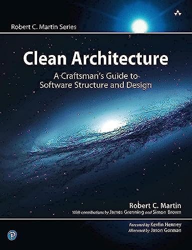
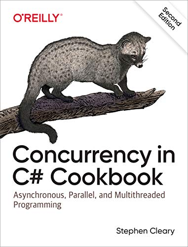
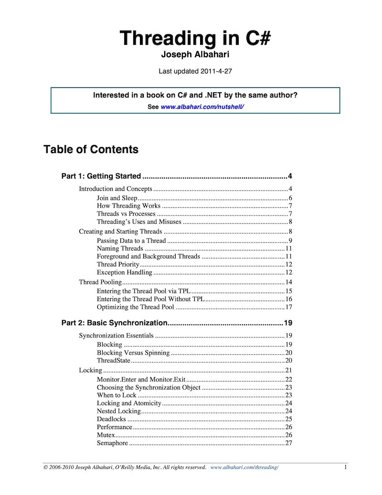
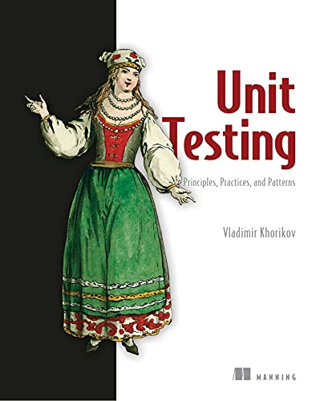

# IT books and blogs

## Table of contents

- [IT books and blogs](#it-books-and-blogs)
  - [Table of contents](#table-of-contents)
  - [IT books](#it-books)
    - [Architecture and design](#architecture-and-design)
      - [Clean Architecture: A Craftsman's Guide to Software Structure and Design](#clean-architecture-a-craftsmans-guide-to-software-structure-and-design)
      - [Design Patterns: Elements of Reusable Object-Oriented Software](#design-patterns-elements-of-reusable-object-oriented-software)
    - [.NET](#net)
      - [Concurrency in C#](#concurrency-in-c)
      - [Threading in C#](#threading-in-c)
      - [Unit Testing Principles, Practices, and Patterns](#unit-testing-principles-practices-and-patterns)
  - [IT blogs](#it-blogs)
    - [YouTube](#youtube)
    - [Text blog](#text-blog)
    - [Telegram](#telegram)

## IT books

### Architecture and design

#### Clean Architecture: A Craftsman's Guide to Software Structure and Design

[↑ Amazon](https://www.amazon.com/Clean-Architecture-Craftsmans-Software-Structure/dp/0134494164).

#### Design Patterns: Elements of Reusable Object-Oriented Software

[↑ Amazon](https://www.amazon.com/Design-Patterns-Elements-Reusable-Object-Oriented/dp/0201633612). [↑ Ozon](https://www.ozon.ru/product/patterny-obektno-orientirovannogo-proektirovaniya-211432335).

### .NET

#### Concurrency in C&#35;

[↑ Amazon](https://www.amazon.com/Concurrency-Cookbook-Asynchronous-Multithreaded-Programming/dp/149205450X).

#### Threading in C&#35;

<https://www.albahari.com/threading>

#### Unit Testing Principles, Practices, and Patterns

[↑ Amazon](https://www.amazon.com/Unit-Testing-Principles-Practices-Patterns-ebook/dp/B09782L692). [↑ Ozon](https://www.ozon.ru/product/printsipy-yunit-testirovaniya-horikov-vladimir-211424826).

## IT blogs

### YouTube

- [↑ Raw Coding](https://www.youtube.com/@RawCoding)
- [↑ Nick Chapsas](https://www.youtube.com/@nickchapsas)
- [↑ Milan Jovanović](https://www.youtube.com/@MilanJovanovicTech)
- [↑ CodeOpinion](https://www.youtube.com/channel/UC3RKA4vunFAfrfxiJhPEplw)

### Text blog

- [↑ Stephen Cleary](https://blog.stephencleary.com)
- <https://devblogs.microsoft.com/dotnet>
- <https://enterprisecraftsmanship.com/posts>
- <https://codeopinion.com/author/dcomartin/>
- <https://www.stevejgordon.co.uk>
- <https://adamsitnik.com/>
- <https://ivanyakimov.blogspot.com>
- <https://www.hanselman.com/blog>
- <https://khalidabuhakmeh.com>
- <https://blog.codingmilitia.com>

### Telegram

- <https://t.me/dotnet_tinkoff>
