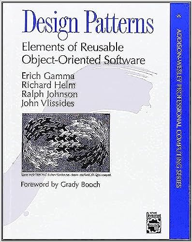

# IT books

## Table of contents

- [IT books](#it-books)
  - [Table of contents](#table-of-contents)
  - [Architecture and design](#architecture-and-design)
    - [Design Patterns: Elements of Reusable Object-Oriented Software](#design-patterns-elements-of-reusable-object-oriented-software)
  - [Unit testing](#unit-testing)
    - [Unit Testing Principles, Practices, and Patterns](#unit-testing-principles-practices-and-patterns)

## Architecture and design

### Design Patterns: Elements of Reusable Object-Oriented Software

[↑ Amazon](https://www.amazon.com/Design-Patterns-Elements-Reusable-Object-Oriented/dp/0201633612). [↑ Ozon](https://www.ozon.ru/product/patterny-obektno-orientirovannogo-proektirovaniya-211432335).

## Unit testing

### Unit Testing Principles, Practices, and Patterns

[↑ Amazon](https://www.amazon.com/Unit-Testing-Principles-Practices-Patterns-ebook/dp/B09782L692). [↑ Ozon](https://www.ozon.ru/product/printsipy-yunit-testirovaniya-horikov-vladimir-211424826).
