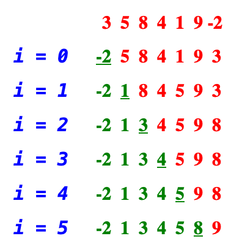
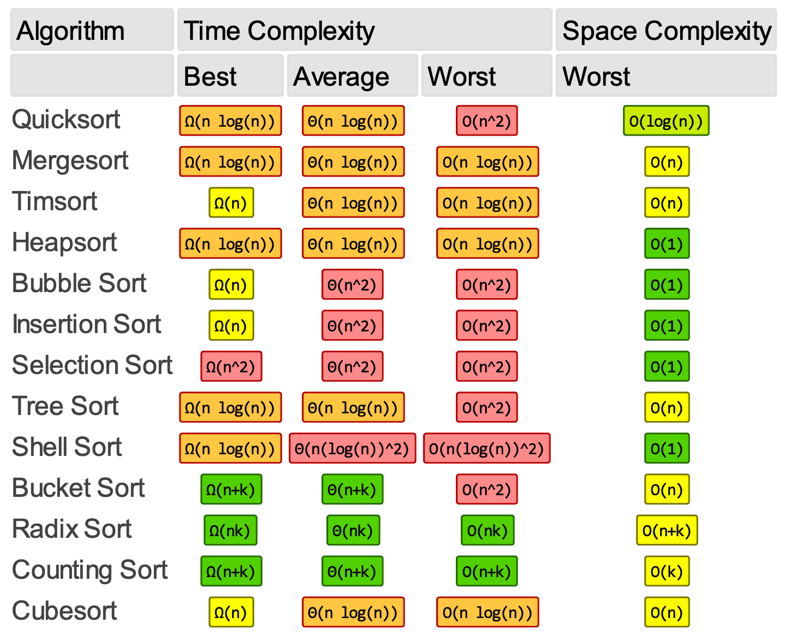

# Algorithms

- [Algorithms](#algorithms)
  - [Binary search](#binary-search)
  - [Breadth-first search](#breadth-first-search)
  - [Bubble sort](#bubble-sort)
  - [Depth-first search](#depth-first-search)
  - [Dijkstra's algorithm](#dijkstras-algorithm)
  - [HyperLogLog](#hyperloglog)
  - [Selection sort](#selection-sort)
  - [Sorting complexities](#sorting-complexities)
  - [Links](#links)

## Binary search

A **binary search** is a search algorithm that finds the position of a target value within a sorted array.

Binary search is a _divide and conquer_ algorithm. Like all divide-and-conquer algorithms, binary search first divides a large array into two smaller subarrays and then recursively or iteratively operates the subarrays. But instead of working on both subarrays, it discards one subarray and continues on the second subarray. This decision of discarding one subarray is made in just one comparison.

Binary search reduces the search space to half at each step. By search space, we mean a subarray of the given array where the target value is located, if present in the array. Initially, the search space is the entire array, and binary search redefines the search space at every step of the algorithm by using the property of the array that it is sorted. It does so by comparing the mid-value in the search space to the target value. If the target value matches the middle element, its position in the array is returned; otherwise, it discards half of the search space based on the comparison result.

C# implementation:

```csharp
public int BinarySearch(int[] array, int number)
{
    int left = 0;
    int right = array.Length - 1;

    while (left <= right)
    {
        int middle = (left + right) / 2; // Overflow can happen.

        if (array[middle] == number)
            return middle;

        if (array[middle] > number)
        {
            right = middle - 1;
        }
        else
        {
            left = middle + 1;
        }
    }

    return -1;
}
```

To avoid integer overflow, we can use any of the following expressions:

```csharp
int middle = left + (right - left) / 2;
```

or:

```csharp
int middle = right - (right - left) / 2;
```

## Breadth-first search

A **breadth-first search** or **BFS** is an algorithm for _traversing_ or _searching_ a tree or graph data structures. The algorithm starts at the root node, selecting some arbitrary node as the root node in the case of a graph, and explores all nodes at the present depth prior to moving on to the nodes at the next depth level. Extra memory, usually a queue, is needed to keep track of the child nodes that were encountered but not yet explored.

## Bubble sort

Each pass of bubble sort steps through the list to be sorted compares each pair of adjacent items and swaps them if they are in the wrong order. At the end of each pass, the next largest element will "Bubble" up to its correct position. These passes through the list are repeated until no swaps are needed, which indicates that the list is sorted. In the worst-case, we might end up making an `n - 1` pass, where `n` is the input size.


Following is the implementation of the bubble sort algorithm in C#. The implementation can be easily optimized by stopping the algorithm when the inner loop didn't do any swap:

```csharp
public void Sort(int[] array)
{
    for (int i = 0; i < array.Length; i++)
    {
        for (int j = 1; j < array.Length - i; j++)
        {
            if (array[j - 1] > array[j])
                (array[j - 1], array[j]) = (array[j], array[j - 1]);
        }
    }
}
```

## Depth-first search

A **depth-first search** (**DFS**) is an algorithm for _traversing_ or _searching_ a tree or graph data structures. The algorithm starts at the root node (selecting some arbitrary node as the root node in the case of a graph) and explores as far as possible along each branch before backtracking.

## Dijkstra's algorithm

**Dijkstra's algorithm** is an algorithm for finding the shortest paths between nodes in a graph, which may represent, for example, road networks.

## HyperLogLog

The [↑ **HyperLogLog**](https://en.wikipedia.org/wiki/HyperLogLog) is an algorithm for the _count-distinct problem_, approximating the number of distinct elements in a [↑ multiset](https://en.wikipedia.org/wiki/Multiset).

Calculating the exact cardinality of the distinct elements of a multiset requires an amount of memory proportional to the cardinality, which is impractical for very large data sets. Probabilistic cardinality estimators, such as the HyperLogLog algorithm, use significantly less memory than this, but can only approximate the cardinality. The HyperLogLog algorithm is able to estimate cardinalities of $> 10^9$ with a typical accuracy (standard error) of 2%, using 1.5 kB of memory. HyperLogLog is an extension of the earlier LogLog algorithm, itself deriving from the 1984 [↑ Flajolet–Martin algorithm](https://en.wikipedia.org/wiki/Flajolet%E2%80%93Martin_algorithm).

The [↑ **count-distinct problem**](https://en.wikipedia.org/wiki/Count-distinct_problem), also known in applied mathematics as the **cardinality estimation problem**, is the problem of finding the number of distinct elements in a data stream with repeated elements. This is a well-known problem with numerous applications. The elements might represent IP addresses of packets passing through a router, unique visitors to a web site, elements in a large database, motifs in a DNA sequence, or elements of RFID/sensor networks.

## Selection sort

The idea is to divide the array into two subsets — sorted subset and unsorted subset. Initially, the sorted subset is empty, and the unsorted subset is the entire input list. The algorithm proceeds by finding the smallest, or largest, depending on sorting order, element in the unsorted subset, swapping it with the leftmost unsorted element. putting it in sorted subset, and moving the subset boundaries one element to the right.

Visual demonstration:



C# implementation:

```csharp
public void Sort(int[] array)
{
    for (int i = 0; i < array.Length; i++)
    {
        int minIndex = i;
        for (int j = i + 1; j < array.Length; j++)
        {
            if (array[j] < array[minIndex])
                minIndex = j;
        }

        (array[i], array[minIndex]) = (array[minIndex], array[i]);
    }
}
```

## Sorting complexities



## Links

[↑ Top 25 Algorithms Every Programmer Should Know](https://medium.com/techie-delight/top-25-algorithms-every-programmer-should-know-373246b4881b)
