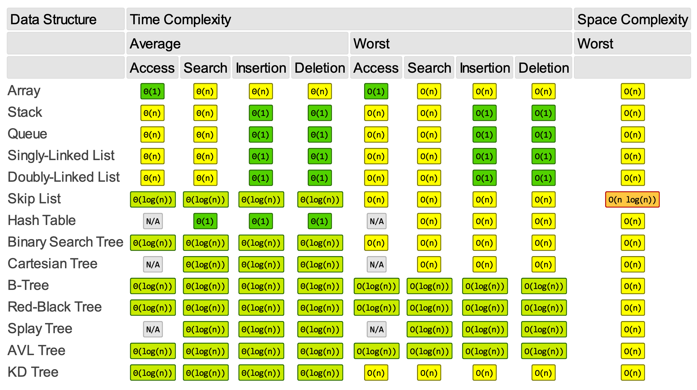

# Data structures

- [Data structures](#data-structures)
  - [Array](#array)
  - [Graph](#graph)
  - [Hash table or hash map](#hash-table-or-hash-map)
  - [Heap](#heap)
  - [Linked list](#linked-list)
  - [Queue](#queue)
  - [Stack](#stack)
  - [Tree](#tree)
    - [B-tree](#b-tree)
    - [Binary tree](#binary-tree)
    - [Binary search tree, BST](#binary-search-tree-bst)
  - [Data structure complexities](#data-structure-complexities)

## Array

## Graph

 A **graph** is a structure amounting to a set of objects in which some pairs of the objects are in some sense "related". The objects correspond to mathematical abstractions called **vertices**, also called *nodes* or *points*, and each of the related pairs of vertices is called an **edge**, also called *link* or *line*.

## Hash table or hash map

## Heap

## Linked list

## Queue

## Stack

## Tree

A **tree** is just a restricted form of a graph that has direction, parent/child relationships, and don't contain cycles. They fit with in the category of directed acyclic graphs, DAGs. So trees are DAGs with the restriction that a child can only have one parent.

A **tree** is an abstract data type that represents a hierarchical tree structure with a set of connected *nodes*.

A **node** is a structure which may contain data and connections to other nodes, sometimes called **edges** or **links**.

Some definitions allow a tree to have no nodes at all, in which case it is called **empty tree**.

Each node in a tree has zero or more **child nodes**, which are below it in the tree; by convention, trees are drawn with descendants going downwards.

A node that has a child is called the child's **parent node** or **superior**.

All nodes have exactly one parent, except the topmost **root node**, which has none.

A node might have many **ancestor nodes**, such as the parent's parent.

Child nodes with the same parent are **sibling nodes**. Typically siblings have an order, with the first one conventionally drawn on the left.

An **internal node**, also known as an **inner node**, **inode** for short, or **branch node**, is any node of a tree that has child nodes. Similarly, an **external node**, also known as an **outer node**, **leaf node**, or **terminal node**, is any node that does not have child nodes.

The **height of a node** is the length of the longest downward path to a leaf from that node.

The height of the root is the **height of the tree**.

The **depth of a node** is the length of the path to its root, i.e., its root path. Thus the root node has depth zero, leaf nodes have height zero, and a tree with only a single node (hence both a root and leaf) has depth and height zero. Conventionally, an empty tree, tree with no nodes, if such are allowed, has height −1.

Each non-root node can be treated as the root node of its own subtree, which includes that node and all its descendants.

### B-tree

A **B-tree** is a self-balancing tree data structure that maintains sorted data and allows searches, sequential access, insertions, and deletions in logarithmic time.

The difference between B-trees and regular trees is that each node in a B-tree can contain more than one value.

When adding new values to the B-tree, we try to add data "lower down", at the maximum depth node.

[↑ Introduction of B-Tree](https://www.geeksforgeeks.org/introduction-of-b-tree-2).

[↑ B-дерево](https://www.youtube.com/watch?v=WXXetwePSRk)

### Binary tree

A **binary tree** is a tree where each node has up to two leaves.

```text
  1
 / \
2   3
```

### Binary search tree, BST

A **binary search tree** or **BST** is a binary tree where the left child contains only nodes with values less than the parent node, and where the right child only contains nodes with values greater than or equal to the parent. BSTs are used for searching.

## Data structure complexities


