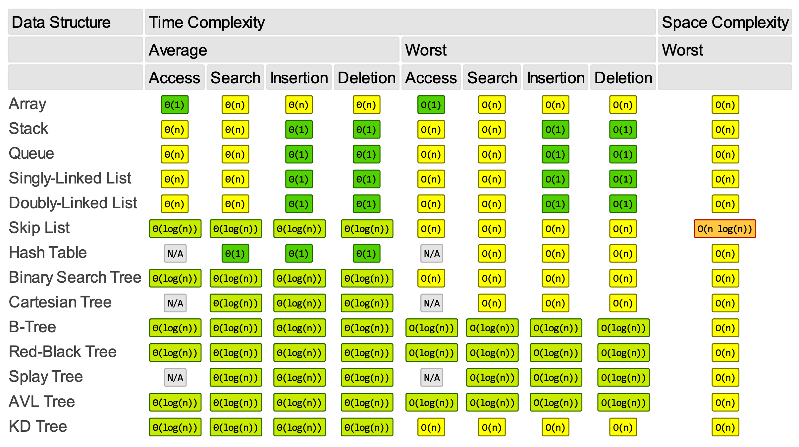

# Data structures

- [Data structures](#data-structures)
  - [Array](#array)
  - [Bloom filter](#bloom-filter)
    - [Description](#description)
    - [Example](#example)
  - [Graph](#graph)
  - [Hash table or hash map](#hash-table-or-hash-map)
  - [Heap](#heap)
  - [Linked list](#linked-list)
  - [Queue](#queue)
  - [Stack](#stack)
  - [Tree](#tree)
    - [B-tree](#b-tree)
    - [Binary tree](#binary-tree)
    - [Binary search tree, BST](#binary-search-tree-bst)
      - [AVL tree](#avl-tree)
  - [Data structure complexities](#data-structure-complexities)

## Array

## Bloom filter

A [↑ **Bloom filter**](https://en.wikipedia.org/wiki/Bloom_filter) is a space-efficient probabilistic data structure, conceived by Burton Howard Bloom in 1970, that is used to test whether an element is a member of a set.

False positive matches are possible, but false negatives are not — in other words, a query returns either "possibly in set" or "definitely not in set".

Elements can be added to the set, but not removed (though this can be addressed with the counting Bloom filter variant); the more items added, the larger the probability of false positives.

[↑ Bloom Filter Calculator](https://hur.st/bloomfilter/).

[↑ Bloom Filters - Part 1 of 3](https://www.youtube.com/watch?v=eCUm4U3WDpM).

### Description

An empty Bloom filter is a bit array of $m$ bits, all set to 0. It is equipped with $k$ different hash functions, which map set elements to one of the $m$ possible array positions. To be optimal, the hash functions should be uniformly distributed and independent. Typically, $k$ is a small constant which depends on the desired false error rate $ε$, while $m$ is proportional to $k$ and the number of elements to be added.

To add an element, feed it to each of the $k$ hash functions to get $k$ array positions. Set the bits at all these positions to 1.

To test whether an element is in the set, feed it to each of the $k$ hash functions to get $k$ array positions. If any of the bits at these positions is 0, the element is definitely not in the set; if it were, then all the bits would have been set to 1 when it was inserted. If all are 1, then either the element is in the set, or the bits have by chance been set to 1 during the insertion of other elements, resulting in a false positive. In a simple Bloom filter, there is no way to distinguish between the two cases, but more advanced techniques can address this problem.

Removing an element from this simple Bloom filter is impossible because there is no way to tell which of the $k$ bits it maps to should be cleared. Although setting any one of those $k$ bits to zero suffices to remove the element, it would also remove any other elements that happen to map onto that bit. Since the simple algorithm provides no way to determine whether any other elements have been added that affect the bits for the element to be removed, clearing any of the bits would introduce the possibility of false negatives.

### Example

Technical interview question:

```text
You have 3 billion URLs.
You need to detect duplicate URLs efficiently.
Memory is limited.
How would you approach this?
```

This is a classic "Big Data" architectural challenge. With 3 billion URLs, a simple hash set is out of the question. If the average URL is 50 characters, you'd need roughly 150 GB of RAM—likely far exceeding your "limited memory" constraints. Here are the two primary approaches:

**I. Bloom filters**: if a tiny margin of error (false positives) is acceptable, a Bloom filter is the most memory-efficient tool. It uses a bit array and multiple hash functions to tell you if an item _might_ be in the set or is _definitely not_.

Each URL is passed through $k$ different hash functions. Each function outputs an index in a bit array, and those bits are set to 1. If you hash a new URL and all $k$ resulting bits are already 1, the URL is likely a duplicate.

For 3 billion items with a 1% false positive rate, you only need about 4.5 GB of RAM—a massive reduction from 150 GB.

**II. MapReduce & External Sorting**: if you cannot afford any false positives (100% accuracy required), you must use disk-based processing.

_Step A:_ You can't fit the data in RAM, so you split it into manageable "buckets" stored on disk. Apply a hash function to each URL: $hash(URL) \pmod n$, where $n$ is the number of small files (e.g., 100 files). All identical URLs will end up in the same file.

_Step B:_ Load one small file into memory at a time. Since the file size is now small (e.g., 1.5 GB), you can use a standard `HashSet` or sort the file to find duplicates. Process these files in parallel across multiple machines if speed is a priority.

```text
Can I just use a database index on URL column to solve this problem of "3 billion URLs"?
```

Standard indexes aren't compressed as tightly as a Bloom filter. A Bloom filter fits 3 billion entries into ~4.5 GB, whereas a database index requires hundreds of gigabytes.

In a real production system, you’d likely use both Bloom filter and database:

1. Bloom filter (in-memory): a "fast-pass" check. If the Bloom filter says "Never seen it," you proceed immediately.

2. Database/NoSQL (on-disk): If the Bloom filter says "maybe," you perform a final check against a fast key-value store like Cassandra or Redis to confirm.

## Graph

A **graph** is a structure amounting to a set of objects in which some pairs of the objects are in some sense "related". The objects correspond to mathematical abstractions called **vertices**, also called _nodes_ or _points_, and each of the related pairs of vertices is called an **edge**, also called _link_ or _line_.

## Hash table or hash map

## Heap

## Linked list

## Queue

## Stack

## Tree

A **tree** is just a restricted form of a graph that has direction, parent/child relationships, and don't contain cycles. They fit with in the category of directed acyclic graphs, DAGs. So trees are DAGs with the restriction that a child can only have one parent.

A **tree** is an abstract data type that represents a hierarchical tree structure with a set of connected _nodes_.

A **node** is a structure which may contain data and connections to other nodes, sometimes called **edges** or **links**.

Some definitions allow a tree to have no nodes at all, in which case it is called **empty tree**.

Each node in a tree has zero or more **child nodes**, which are below it in the tree; by convention, trees are drawn with descendants going downwards.

A node that has a child is called the child's **parent node** or **superior**.

All nodes have exactly one parent, except the topmost **root node**, which has none.

A node might have many **ancestor nodes**, such as the parent's parent.

Child nodes with the same parent are **sibling nodes**. Typically siblings have an order, with the first one conventionally drawn on the left.

An **internal node**, also known as an **inner node**, **inode** for short, or **branch node**, is any node of a tree that has child nodes. Similarly, an **external node**, also known as an **outer node**, **leaf node**, or **terminal node**, is any node that does not have child nodes.

The **height of a node** is the length of the longest downward path to a leaf from that node.

The height of the root is the **height of the tree**.

The **depth of a node** is the length of the path to its root, i.e., its root path. Thus the root node has depth zero, leaf nodes have height zero, and a tree with only a single node (hence both a root and leaf) has depth and height zero. Conventionally, an empty tree, tree with no nodes, if such are allowed, has height −1.

Each non-root node can be treated as the root node of its own subtree, which includes that node and all its descendants.

### B-tree

A [↑ **B-tree**](https://en.wikipedia.org/wiki/B-tree) is a self-balancing tree data structure that maintains sorted data and allows searches, sequential access, insertions, and deletions in logarithmic time.

The difference between B-trees and regular trees is that each node in a B-tree can contain more than one value.

[↑ Построение B-дерева](https://www.youtube.com/watch?v=WXXetwePSRk).

### Binary tree

A **binary tree** is a tree data structure in which each node has at most two children, referred to as the _left child_ and the _right child_. That is, it is a [↑ m-ary tree](https://en.wikipedia.org/wiki/M-ary_tree) with `k = 2`.

A labeled binary tree of size 9 (the number of nodes in the tree) and height 3 (the height of a tree defined as the number of edges or links from the top-most or root node to the farthest leaf node), with a root node whose value is 1:


The above tree is unbalanced and not sorted.

### Binary search tree, BST

A **binary search tree** or **BST**, also called an **ordered** or **sorted binary tree**, is a _rooted_ binary tree data structure with the key of each internal node being greater than all the keys in the respective node's left subtree and less than the ones in its right subtree.

A **rooted tree** is a tree in which one vertex has been designated the root.

BSTs are used for searching.

A binary search tree of size 9 and depth 3, with 8 at the root:


#### AVL tree

## Data structure complexities


