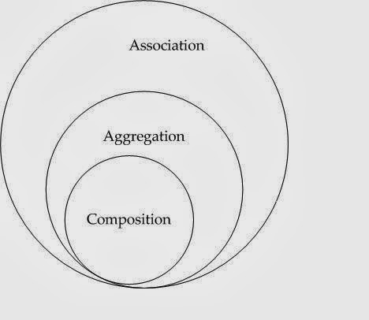

# Aggregation and composition

- [Aggregation and composition](#aggregation-and-composition)
  - [Wikipedia](#wikipedia)
  - [StackExchange](#stackexchange)
    - [Answer 1](#answer-1)
    - [Answer 2](#answer-2)
    - [Answer 3](#answer-3)
  - [UML cheat sheet](#uml-cheat-sheet)

## Wikipedia

Aggregation differs from ordinary composition in that it does not imply ownership. In composition, when the owning object is destroyed, so are the contained objects. In aggregation, this is not necessarily true. For example, a university owns various departments, and each department has a number of professors. If the university closes, the departments will no longer exist, but the professors in those departments will continue to exist. Therefore, a university can be seen as a composition of departments, whereas departments have an aggregation of professors. In addition, a professor could work in more than one department, but a department could not be part of more than one university.

Composition is usually implemented such that an object contains another object.

[Link ↑](https://en.wikipedia.org/wiki/Object_composition#Aggregation)

## StackExchange

### Answer 1

- **Composition** is an association
- **Aggregation** is an association



- Composition is a _strong association_ (if the life of contained object totally depends on the container object, it is called _strong association_)
- Aggregation is a _weak association_ (if the life of contained object doesn't depends on the container object, it is called _weak association_)

```csharp
A a = new();

B b = new B();
a.B = b; // Aggregation

class A
{
    private B _b;

    public A()
    {
        _b = new B(); // Composition
    }

    public B B { get; set; }
}

class B
{
}
```

### Answer 2

There is no single explanation. Different authors mean different things by aggregation. Most don't really mean anything specific by it.

### Answer 3

**Composition** (mixture) is a way to combine simple objects or data types into more complex ones. Compositions are a critical building block of many basic data structures.

**Aggregation** (collection) differs from ordinary composition in that it does not imply ownership. In composition, when the owning object is destroyed, so are the contained objects. In aggregation, this is not necessarily true.

|           | Aggregation             | Composition               |
| --------- | ----------------------- | ------------------------- |
| Life time | Have their own lifetime | Owner's life time         |
| Relation  | Has                     | Part-of                   |
| Example   | `Car` has driver        | `Engine` is part of `Car` |

UML notations for different kinds of dependencies between two objects:


## UML cheat sheet

From the book "Head First Object-Oriented Analysis & Design": <sup>1</sup>


[Link ↑](https://softwareengineering.stackexchange.com/questions/61376/aggregation-vs-composition)

<hr>

<sup>1</sup> Head First Object-Oriented Analysis & Design, O'Reilly Media; 1st edition (December 19, 2006), page 400
