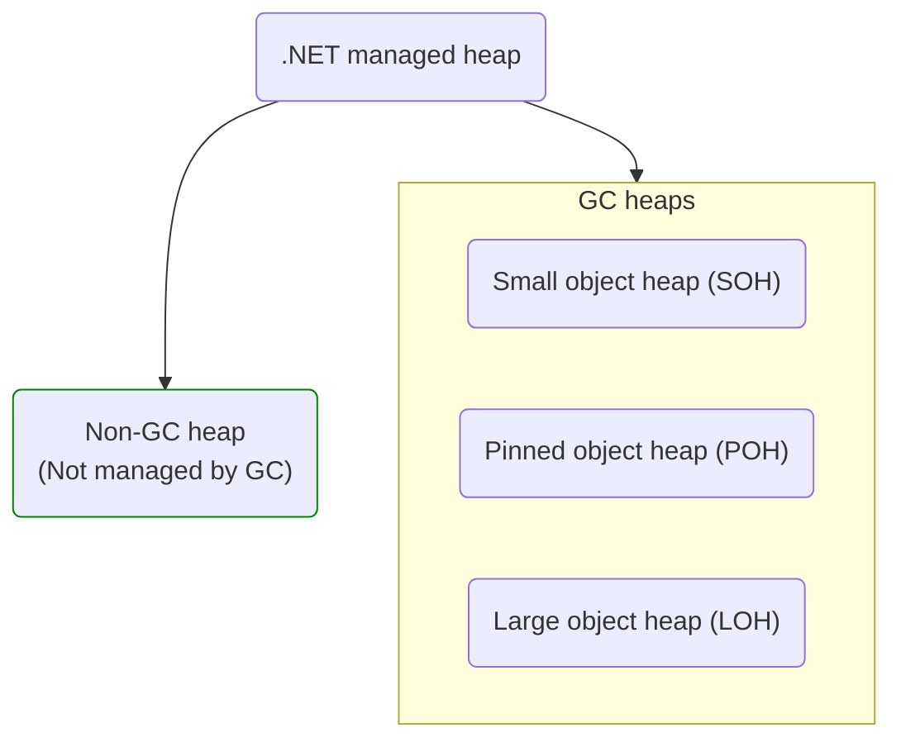

# Garbage collection, SOH, LOH, POH, P/Invoke

## Table of contents

- [Garbage collection, SOH, LOH, POH, P/Invoke](#garbage-collection-soh-loh-poh-pinvoke)
  - [Table of contents](#table-of-contents)
  - [Garbage collection](#garbage-collection)
  - [Stack](#stack)
  - [Managed heap](#managed-heap)
    - [Non-GC heap](#non-gc-heap)
    - [SOH](#soh)
    - [LOH](#loh)
    - [POH](#poh)
  - [P/Invoke](#pinvoke)
  - [Ephemeral generations and segments](#ephemeral-generations-and-segments)

## Garbage collection

A **garbage collection** is an automatic memory management feature in .NET that allocates and releases memory with help of _garbage collector_.

A **garbage collector** or **GC** is as an automatic memory manager in the [↑ CLR](https://learn.microsoft.com/en-us/dotnet/standard/clr) that allocates and releases memory for your application.

Also the term _garbage collection_ often refers to only [releasing memory](#memory-release) as opposed to both allocating and releasing memory.

When you initialize a new process, the runtime reserves a contiguous region of address space for the process — the [managed heap](#managed-heap).

All [reference types](/csharp/types/reference-types/reference-types.md) are allocated on the managed heap.

When an application creates the first reference type, memory is allocated for the type at the base address of the managed heap. As long as address space is available, the runtime continues to allocate space for new objects.

Before a garbage collection starts, all managed threads are suspended except for the thread that triggered the garbage collection.

## Stack

A **stack** is used for storing [value types](/csharp/types/value-types/value-types.md), method parameters, and local variables. It operates on a Last-In-First-Out (LIFO) principle, where memory is allocated and deallocated as methods are called and return.

Each thread in a .NET application has its own dedicated stack.

## Managed heap

A **managed heap** is a contiguous region of address space reserved by runtime for the process.

All threads in the process allocate memory for objects on the same heap.

A general overview of the .NET managed heap:



The managed heap maintains a pointer to the address where the next object in the heap will be allocated. Initially, this pointer is set to the managed heap's base address. All reference types are allocated on the managed heap. When an application creates the first reference type, memory is allocated for the type at the base address of the managed heap. When the application creates the next object, the garbage collector allocates memory for it in the address space immediately following the first object.

Allocating memory from the managed heap is faster than unmanaged memory allocation. Because the runtime allocates memory for an object by adding a value to a pointer, it's almost as fast as allocating memory from the stack. In addition, because new objects that are allocated consecutively are stored contiguously in the managed heap, an application can access the objects quickly.

### Non-GC heap

.NET 8.0 introduced a new concept called a _non-GC heap_.

A [↑ **non-GC heap**](https://github.com/dotnet/runtime/blob/main/docs/design/features/NonGC-Heap.md) is a specialized heap that is not managed by the garbage collector and is designed to store immortal objects with certain benefits for GC and code generation.

The basic idea that certain kinds of objects are essentially immortal and will never be collected, hence, we can put them into a separate storage where they are never scanned or compacted. All string literals are [interned](/csharp/types/reference-types/string.md#string-interning-and-stringempty) and therefore immortal.

Although the name is new, the feature is based on pre-existing [↑ frozen segments](https://minidump.net/exploring-frozen-segments) which were added long time ago to serve a similar purpose. What's changed in .NET 8.0 is that this functionality has been exposed to users through public profiling and debugging APIs, and it is now heavily leveraged for several codegen optimizations in [RyuJIT](/dotnet/roslyn.md#ryujit).

### SOH

A **small object heap** or **SOH** is a memory zone for objects smaller than 85 kilobytes.

The 85KB threshold was determined empirically as the point beyond which defragmentation no longer provides significant performance benefits.

### LOH

A **large object heap**, or **LOH** for short is a special memory zone for objects that are greater than 85,000 bytes.

LOH objects and collected during generation 2 garbage collection.

By default LOH objects are not compacted.

.NET Core and .NET Framework, starting with version 4.5.1, include the [↑ `GCSettings.LargeObjectHeapCompactionMode`](https://learn.microsoft.com/en-us/dotnet/api/system.runtime.gcsettings.largeobjectheapcompactionmode) property that allows users to specify that the LOH should be compacted during the next full blocking garbage collection. And in the future, .NET may decide to compact the LOH automatically. This means that, if you allocate large objects and want to make sure that they don't move, you should still pin them.

In addition, the LOH is [↑ automatically compacted](https://learn.microsoft.com/en-us/dotnet/standard/garbage-collection/fundamentals#what-happens-during-a-garbage-collection) when a hard limit is set by specifying either:

- A memory limit on a container
- The [↑ `GCHeapHardLimit`](https://learn.microsoft.com/en-us/dotnet/core/runtime-config/garbage-collector#heap-limit) or [↑ `GCHeapHardLimitPercent`](https://learn.microsoft.com/en-us/dotnet/core/runtime-config/garbage-collector#heap-limit-percent) runtime configuration options

[↑ The large object heap on Windows systems](https://learn.microsoft.com/en-us/dotnet/standard/garbage-collection/large-object-heap).

### POH

The [↑ **pinned object heap**](https://devblogs.microsoft.com/dotnet/internals-of-the-poh/), or [↑ **POH**](https://github.com/dotnet/runtime/blob/main/docs/design/features/PinnedHeap.md), is a specialized heap introduced in .NET 5.0 as part of the .NET runtime.

Pinning objects in C# is primarily used to ensure that an object remains at a fixed memory location and does not get moved by the garbage collector. This is particularly important in scenarios where you need to pass a reference from [↑ managed memory to unmanaged code](https://learn.microsoft.com/en-us/dotnet/framework/interop/copying-and-pinning), such as when working with [P/Invoke](#pinvoke) or interfacing with low-level system components. Pinning an object prevents the GC from relocating it, ensuring that the unmanaged code receives a stable pointer.

Here's a simple example demonstrating how to pin an array and pass it to unmanaged code using the [↑ `fixed`](https://learn.microsoft.com/en-us/dotnet/csharp/language-reference/statements/fixed) statement:

```csharp
[DllImport("SomeNativeLibrary.dll")]
static extern void NativeFunction(IntPtr ptr);

var data = new byte[100];

unsafe
{
    // Pin the array and get a pointer to its data using `fixed` statement.
    // The `byte* pointer` is a pointer to the first element of the array.
    fixed (byte* pointer = data)
    {
        // Convert the pointer to an `IntPtr` that can be passed to the unmanaged function `NativeFunction`
        var intPointer = (IntPtr)pointer;
        NativeFunction(intPointer);
    }
}
```

Another approach to pinning objects is using the [↑ `GCHandle`](https://learn.microsoft.com/en-us/dotnet/api/system.runtime.interopservices.gchandle) structure, which provides more control over the pinning process and can pin any managed object, not just arrays:

```csharp
[DllImport("SomeNativeLibrary.dll")]
static extern void NativeFunction(IntPtr ptr);

var data = new byte[100];
GCHandle gcHandle = GCHandle.Alloc(value: data, type: GCHandleType.Pinned); // Pin the data array

try
{
    IntPtr intPointer = gcHandle.AddrOfPinnedObject(); // Retrieve the pinned memory address
    NativeFunction(intPointer);
}
finally
{
    gcHandle.Free(); // Release the pinning once it is no longer needed
}
```

## P/Invoke

The [↑ P/Invoke](https://learn.microsoft.com/en-us/dotnet/standard/native-interop/pinvoke) or **platform invoke** is a technology that allows you to access structs, callbacks, and functions in unmanaged libraries from your managed code.

## Ephemeral generations and segments

Because objects in generations 0 and 1 are short-lived, these generations are known as the _ephemeral generations_.

Ephemeral generations are allocated in the _memory segment_ that's known as the _ephemeral segment_. Each new segment acquired by the garbage collector becomes the new ephemeral segment and contains the objects that survived a generation 0 garbage collection. The old ephemeral segment becomes the new generation 2 segment.

The size of the ephemeral segment varies depending on whether a system is 32-bit or 64-bit and on the type of garbage collector it is running (workstation or server GC). The following table shows the default sizes of the ephemeral segment.

| Workstation/server GC           | 32-bit | 64-bit |
| ------------------------------- | ------ | ------ |
| Workstation GC                  | 16 MB  | 256 MB |
| Server GC                       | 64 MB  | 4 GB   |
| Server GC with > 4 logical CPUs | 32 MB  | 2 GB   |
| Server GC with > 8 logical CPUs | 16 MB  | 1 GB   |

The ephemeral segment can include generation 2 objects. Generation 2 objects can use multiple segments (as many as your process requires and memory allows for).

The amount of freed memory from an ephemeral garbage collection is limited to the size of the ephemeral segment. The amount of memory that is freed is proportional to the space that was occupied by the dead objects.

[↑ Understanding different GC modes with Concurrency Visualizer](https://devblogs.microsoft.com/premier-developer/understanding-different-gc-modes-with-concurrency-visualizer/).
