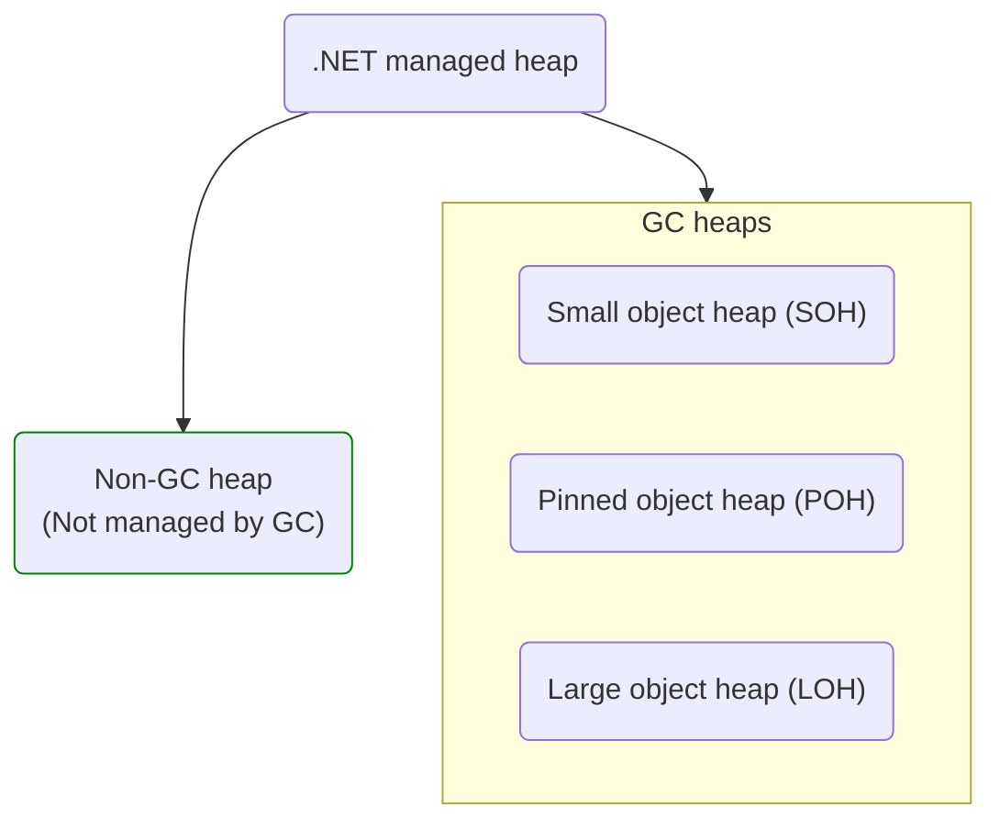

# Garbage collector

In the CLR the garbage collector (GC) serves as an automatic memory manager.

[↑ Fundamentals of garbage collection](https://learn.microsoft.com/en-us/dotnet/standard/garbage-collection/fundamentals).

## Table of contents

- [Garbage collector](#garbage-collector)
  - [Table of contents](#table-of-contents)
  - [Benefits](#benefits)
  - [Fundamentals of memory](#fundamentals-of-memory)
  - [Memory allocation](#memory-allocation)
  - [Conditions for a garbage collection](#conditions-for-a-garbage-collection)
  - [Ephemeral generations and segments](#ephemeral-generations-and-segments)
  - [Non-GC heap](#non-gc-heap)
  - [Large object heap, LOH](#large-object-heap-loh)
  - [Pinned objects heap, POH](#pinned-objects-heap-poh)
    - [`fixed` keyword](#fixed-keyword)
    - [`GCHandle`](#gchandle)
  - [Platform invoke, P/Invoke](#platform-invoke-pinvoke)

## Benefits

- Frees developers from having to manually release memory.
- Allocates objects on the managed heap efficiently.
- Reclaims objects that are no longer being used, clears their memory, and keeps the memory available for future allocations. Managed objects automatically get clean content to start with, so their constructors don't have to initialize every data field.
- Provides memory safety by making sure that an object cannot use the content of another object.

## Fundamentals of memory

- Each process has its own, separate **virtual address space**. All processes on the same computer share the same physical memory and the page file, if there is one.
- By default, on 32-bit computers, each process has a 2-GB user-mode virtual address space.
- As an application developer, you work only with virtual address space and never manipulate physical memory directly. The garbage collector allocates and frees virtual memory for you on the managed heap.
- Virtual memory can be in three states:
  - **Free** — The block of memory has no references to it and is available for allocation.
  - **Reserved** — The block of memory is available for your use and cannot be used for any other allocation request. However, you cannot store data to this memory block until it is committed.
  - **Commited** — The block of memory is assigned to physical storage.
- Virtual address space can get fragmented. This means that there are free blocks, also known as holes, in the address space. When a virtual memory allocation is requested, the virtual memory manager has to find a single free block that is large enough to satisfy that allocation request. Even if you have 2 GB of free space, an allocation that requires 2 GB will be unsuccessful unless all of that free space is in a single address block.
- You can run out of memory if there isn't enough virtual address space to reserve or physical space to commit.

## Memory allocation

When you initialize a new process, the runtime reserves a contiguous region of address space for the process. This reserved address space is called the **managed heap** as opposed to a native heap in the operating system. There is a managed heap for each managed process. All threads in the process allocate memory for objects on the same heap.

The heap can be considered as the accumulation of two heaps: the **large object heap** and the **small object heap**. The large object heap contains objects that are 85,000 bytes and larger, which are usually arrays. It's rare for an instance object to be extremely large.

The managed heap maintains a pointer to the address where the next object in the heap will be allocated. Initially, this pointer is set to the managed heap's base address. All reference types are allocated on the managed heap. When an application creates the first reference type, memory is allocated for the type at the base address of the managed heap. When the application creates the next object, the garbage collector allocates memory for it in the address space immediately following the first object.

Allocating memory from the managed heap is faster than unmanaged memory allocation. Because the runtime allocates memory for an object by adding a value to a pointer, it's almost as fast as allocating memory from the stack. In addition, because new objects that are allocated consecutively are stored contiguously in the managed heap, an application can access the objects quickly.

## Conditions for a garbage collection

- The system has low physical memory. This is detected by either the low memory notification from the OS or low memory as indicated by the host.
- The memory that's used by allocated objects on the managed heap surpasses an acceptable threshold. This threshold is continuously adjusted as the process runs.
- The `GC.Collect` method is called. In almost all cases, you don't have to call this method, because the garbage collector runs continuously. This method is primarily used for unique situations and testing.

Garbage collections occur on specific generations as conditions warrant. Collecting a generation means collecting objects in that generation and all its younger generations. A generation 2 garbage collection is also known as a *full garbage collection*, because it reclaims objects in all generations (that is, all objects in the managed heap).

The CLR continually balances two priorities: not letting an application's working set get too large by delaying garbage collection and not letting the garbage collection run too frequently.

Before a garbage collection starts, all managed threads are suspended except for the thread that triggered the garbage collection.

## Ephemeral generations and segments

Because objects in generations 0 and 1 are short-lived, these generations are known as the *ephemeral generations*.

Ephemeral generations are allocated in the *memory segment* that's known as the *ephemeral segment*. Each new segment acquired by the garbage collector becomes the new ephemeral segment and contains the objects that survived a generation 0 garbage collection. The old ephemeral segment becomes the new generation 2 segment.

The size of the ephemeral segment varies depending on whether a system is 32-bit or 64-bit and on the type of garbage collector it is running (workstation or server GC). The following table shows the default sizes of the ephemeral segment.

| Workstation/server GC           | 32-bit | 64-bit |
| ------------------------------- | ------ | ------ |
| Workstation GC                  | 16 MB  | 256 MB |
| Server GC                       | 64 MB  | 4 GB   |
| Server GC with > 4 logical CPUs | 32 MB  | 2 GB   |
| Server GC with > 8 logical CPUs | 16 MB  | 1 GB   |

The ephemeral segment can include generation 2 objects. Generation 2 objects can use multiple segments (as many as your process requires and memory allows for).

The amount of freed memory from an ephemeral garbage collection is limited to the size of the ephemeral segment. The amount of memory that is freed is proportional to the space that was occupied by the dead objects.

[↑ Understanding different GC modes with Concurrency Visualizer](https://devblogs.microsoft.com/premier-developer/understanding-different-gc-modes-with-concurrency-visualizer/).

## Non-GC heap

The **non-GC heap** is a specialized heap that is not managed by the garbage collector and is designed to store immortal objects with certain benefits for GC and code generation.

Non-GC heap was introduced in .NET 8.0. The basic idea that certain kinds of objects are essentially immortal and will never be collected, hence, we can put them into a separate storage where they are never scanned or compacted. All string literals are [interned](/csharp/types/reference-types/string.md#string-interning-and-stringempty) and therefore immortal.

A general overview of the .NET managed heap:



[↑ NonGC Heap](https://github.com/dotnet/runtime/blob/main/docs/design/features/NonGC-Heap.md).

[↑ Exploring .NET frozen segments](https://minidump.net/exploring-frozen-segments).

## Large object heap, LOH

The **large object heap**, or **LOH** for short is a special memory zone for objects that are greater than 85,000 bytes. LOH objects are not compacted and collected during generation 2 garbage collection.

## Pinned objects heap, POH

The **pinned object heap**, or **POH**, is a specialized heap introduced in .NET 5.0 as part of the .NET runtime.

Pinning objects in C# is primarily used to ensure that an object remains at a fixed memory location and does not get moved by the garbage collector. This is particularly important in scenarios where you need to pass a reference to managed memory to unmanaged code, such as when working with [P/Invoke](#platform-invoke-pinvoke) or interfacing with low-level system components. Pinning an object prevents the GC from relocating it, ensuring that the unmanaged code receives a stable pointer.

### `fixed` keyword

Here's a simple example demonstrating how to pin an array and pass it to unmanaged code using the [`fixed`](https://learn.microsoft.com/en-us/dotnet/csharp/language-reference/statements/fixed) statement:

```csharp
using System.Runtime.InteropServices;

[DllImport("SomeNativeLibrary.dll")]
static extern void NativeFunction(IntPtr ptr);

byte[] data = new byte[100];

// Pin the array and get a pointer to its data
unsafe
{
    fixed (byte* pData = data)
    {
        IntPtr ptr = (IntPtr)pData;
        NativeFunction(ptr);
    }
}
```

In this example:

- The `fixed` statement is used to pin the `data` array
- The `byte* pData` is a pointer to the first element of the array
- `IntPtr ptr = (IntPtr)pData` converts the pointer to an `IntPtr` that can be passed to the unmanaged function `NativeFunction`

### `GCHandle`

Another approach to pinning objects is using the [↑ `GCHandle`](https://learn.microsoft.com/en-us/dotnet/api/system.runtime.interopservices.gchandle) struct, which provides more control over the pinning process and can pin any managed object, not just arrays:

```csharp
using System.Runtime.InteropServices;

[DllImport("SomeNativeLibrary.dll")]
static extern void NativeFunction(IntPtr ptr);

byte[] data = new byte[100];
GCHandle handle = GCHandle.Alloc(data, GCHandleType.Pinned);

try
{
    IntPtr ptr = handle.AddrOfPinnedObject();
    NativeFunction(ptr);
}
finally
{
    handle.Free();
}
```

In this example:

- `GCHandle.Alloc(data, GCHandleType.Pinned)` pins the data array
- `handle.AddrOfPinnedObject()` retrieves the pinned memory address
- `handle.Free()` releases the pinning once it is no longer needed

[↑ Pinned Heap](https://github.com/dotnet/runtime/blob/main/docs/design/features/PinnedHeap.md).

## Platform invoke, P/Invoke

The [↑ P/Invoke](https://learn.microsoft.com/en-us/dotnet/standard/native-interop/pinvoke) is a technology that allows you to access structs, callbacks, and functions in unmanaged libraries from your managed code.
