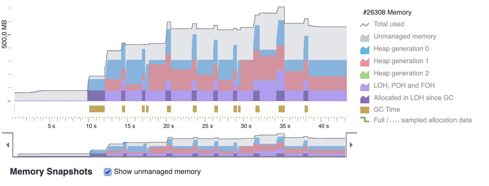
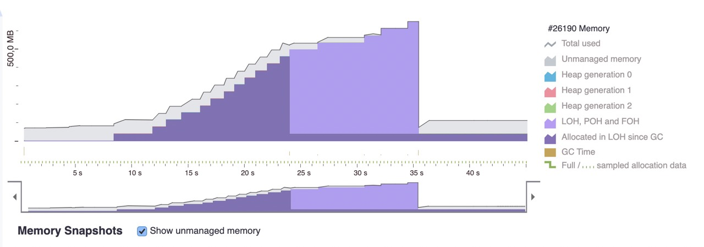

# dotMemory

[↑ dotMemory](https://www.jetbrains.com/dotmemory) is a .NET memory profiler.

## Table of contents

- [dotMemory](#dotmemory)
  - [Table of contents](#table-of-contents)
  - [Generating large strings to fill up LOH](#generating-large-strings-to-fill-up-loh)
  - [Generate large arrays of `class` and `struct`](#generate-large-arrays-of-class-and-struct)
    - [`class`](#class)
    - [`struct`](#struct)

## Generating large strings to fill up LOH

Set memory limit to 300 MB using [↑ `System.GC.HeapHardLimit`](https://learn.microsoft.com/en-us/dotnet/core/runtime-config/garbage-collector#heap-limit) setting inside [↑ `runtimeconfig.template.json`](https://learn.microsoft.com/en-us/dotnet/core/runtime-config/#runtimeconfigjson) config:

```json
{
  "configProperties": {
    "System.GC.HeapHardLimit": 300000000
  }
}
```

Code of `/api/generate-large-strings` minimal API endpoint:

```csharp
public static class GenerateLargeStringsEndpoint
{
    public static void GenerateLargeStrings(this IEndpointRouteBuilder builder, string routePattern)
    {
        builder.MapPost(routePattern, (ILoggerFactory loggerFactory) =>
            {
                var logger = loggerFactory.CreateLogger(nameof(GenerateLargeStringsEndpoint));
                logger.LogInformation(
                    $"TotalAvailableMemoryBytes: {GC.GetGCMemoryInfo().TotalAvailableMemoryBytes}");

                var list = new List<string>();
                var counter = 1;

                while (true)
                {
                    var randomString = RandomNumberGenerator.GetString(
                        choices: "ABCDEFGHIJKLMNOPQRSTUVWXYZabcdefghijklmnopqrstuvwxyz0123456789",
                        length: 10_000_000);

                    list.Add(randomString);
                    logger.LogInformation("Added string " + counter);

                    counter++;

                    Thread.Sleep(500);

                    if (counter > 10)
                    {
                        break;
                    }
                }

                logger.LogInformation("Broke the loop");

                return Results.Ok();
            })
            .WithOpenApi(x => new OpenApiOperation(x) { Summary = "Generate large strings" });
    }
}

// Output:
// 
// [22:22:05 INF] TotalAvailableMemoryBytes: 300000000
// [22:22:07 INF] Added string 1
// [22:22:09 INF] Added string 2
// [22:22:12 INF] Added string 3
// [22:22:14 INF] Added string 4
// [22:22:16 INF] Added string 5
// [22:22:19 INF] Added string 6
// [22:22:21 INF] Added string 7
// [22:22:23 INF] Added string 8
// [22:22:25 INF] Added string 9
// [22:22:27 INF] Added string 10
// [22:22:28 INF] Broke the loop
```

Setting heap hard limit to 100 MB throws OOM exception on the first endpoint call. OOM exception does not cause process crash though.

```console
[22:43:37 INF] TotalAvailableMemoryBytes: 100000000
[22:43:38 INF] Added string 1
[22:43:40 INF] Added string 2
[22:43:42 INF] Added string 3
[22:43:44 INF] Added string 4
[22:43:45 ERR] HTTP POST /api/generate-large-strings responded 500 in 7627.7617 ms
System.OutOfMemoryException: Exception of type 'System.OutOfMemoryException' was thrown.
...
...
```

Memory diagram after calling `/api/generate-large-strings` endpoint 3 times:


## Generate large arrays of `class` and `struct`

### `class`

```csharp
public class Class
{
    public int Id { get; set; }
}
```

```csharp
public static class GenerateLargeArrayEndpoint
{
    public static void GenerateLargeArray(this IEndpointRouteBuilder builder, string routePattern)
    {
        builder.MapPost(routePattern, () =>
            {
                var array = new Class[10_000_000];
                for (var i = 0; i < 10_000_000; i++)
                {
                    array[i] = new Class { Id = i };
                }

                return Results.Ok();
            })
            .WithOpenApi(x => new OpenApiOperation(x) { Summary = "Generate large arrays" });
    }
}
```

Profile after calling endpoint about ten times:



### `struct`

```csharp
public struct Structure
{
    public int Id { get; set; }
}
```

```csharp
public static class GenerateLargeArrayEndpoint
{
    public static void GenerateLargeArray(this IEndpointRouteBuilder builder, string routePattern)
    {
        builder.MapPost(routePattern, () =>
            {
                var array = new Structure[10_000_000];
                for (var i = 0; i < 10_000_000; i++)
                {
                    array[i] = new Structure { Id = i };
                }

                return Results.Ok();
            })
            .WithOpenApi(x => new OpenApiOperation(x) { Summary = "Generate large arrays" });
    }
}
```

Profile after calling endpoint about seventeen times:


