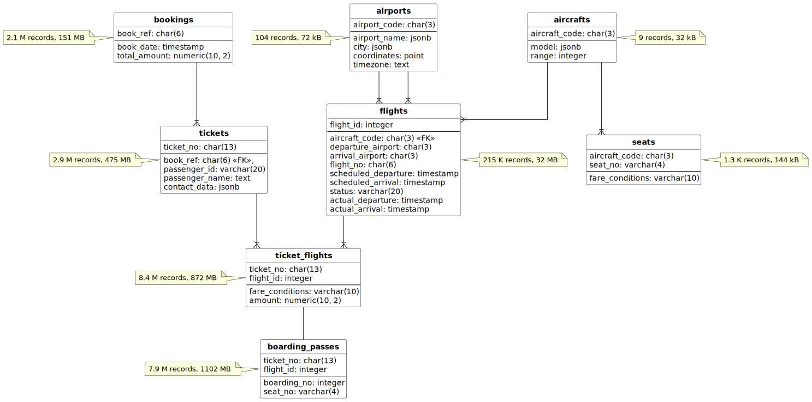
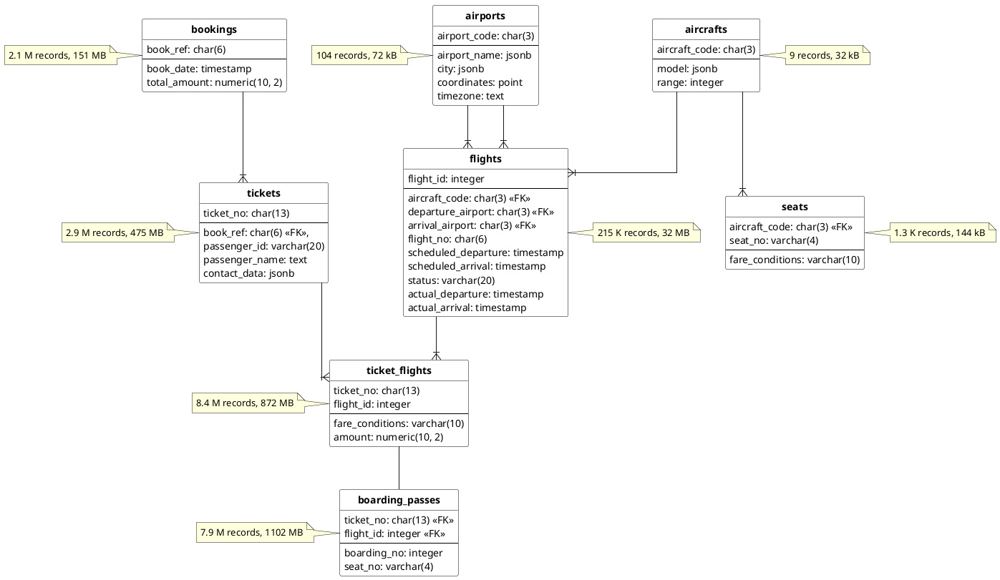

# Air transportation database

## Table of contents

- [Air transportation database](#air-transportation-database)
  - [Table of contents](#table-of-contents)
  - [Installation](#installation)
  - [Common diagram](#common-diagram)
  - [Tables, functions](#tables-functions)
    - [`bookings`](#bookings)
    - [`now` (function)](#now-function)
    - [`tickets`](#tickets)
    - [`tickets_flights`](#tickets_flights)
    - [`flights`](#flights)
    - [`airports`](#airports)
    - [`flights_v` (view)](#flights_v-view)
    - [`routes` (view)](#routes-view)
    - [`aircrafts`](#aircrafts)
    - [`seats`](#seats)
    - [`boarding_passes`](#boarding_passes)

## Installation

Run Postgres with [docker-compose.yaml](docker-compose.yaml) file:

```bash
docker-compose up --detach
```

Restore [↑ demo database](https://postgrespro.com/community/demodb):

```bash
cat ~/Downloads/demo-big-20170815.sql | docker exec --interactive air-transportation \
psql -U postgres
```

## Common diagram

<!--  -->



## Tables, functions

### `bookings`

```sql
SELECT *
FROM bookings
WHERE book_ref = '0824C5';
```

| book_ref | book_date                         | total_amount |
| :------- | :-------------------------------- | :----------- |
| 0824C5   | 2017-07-25 20:36:00.000000 +00:00 | 112400.00    |

|                |                |                                           |
| -------------- | -------------- | ----------------------------------------- |
| _Booking code_ | _Booking date_ | _Total sum of all tickets inside booking_ |

### `now` (function)

```sql
SELECT bookings.now();
```

| now                               |
| :-------------------------------- |
| 2017-08-15 15:00:00.000000 +00:00 |

```sql
SELECT bookings.now() - b.book_date AS "Date difference"
FROM bookings b
WHERE b.book_ref = '0824C5';
```

| Date difference                                  |
| :----------------------------------------------- |
| 0 years 0 mons 20 days 18 hours 24 mins 0.0 secs |

### `tickets`

```sql
SELECT t.*
FROM bookings b
         JOIN tickets t ON b.book_ref = t.book_ref
WHERE b.book_ref = '0824C5';
```

| ticket_no     | book_ref | passenger_id | passenger_name    | contact_data              |
| :------------ | :------- | :----------- | :---------------- | :------------------------ |
| 0005435126781 | 0824C5   | 7247 393204  | ALEKSANDR MATVEEV | {"phone": "+70095062310"} |
| 0005435126782 | 0824C5   | 1745 826066  | NINA KRASNOVA     | {"phone": "+70876976071"} |

### `tickets_flights`

```sql
SELECT tf.*
FROM tickets t
         JOIN ticket_flights tf ON t.ticket_no = tf.ticket_no
WHERE t.ticket_no = '0005435126781';
```

| ticket_no     | flight_id | fare_conditions | amount   |
| :------------ | :-------- | :-------------- | :------- |
| 0005435126781 | 22566     | Economy         | 11700.00 |
| 0005435126781 | 71439     | Economy         | 3200.00  |
| 0005435126781 | 74643     | Economy         | 8800.00  |
| 0005435126781 | 94335     | Economy         | 11700.00 |
| 0005435126781 | 95726     | Economy         | 3200.00  |
| 0005435126781 | 206625    | Business        | 26400.00 |

### `flights`

```sql
SELECT tf.*
FROM tickets t
         JOIN ticket_flights tf ON t.ticket_no = tf.ticket_no
WHERE t.ticket_no = '0005435126781';
```

| flight_id | scheduled_departure               | departure_airport | arrival_airport | status    | aircraft_code |
| :-------- | :-------------------------------- | :---------------- | :-------------- | :-------- | :------------ |
| 22566     | 2017-08-12 08:00:00.000000 +00:00 | VKO               | PEE             | Arrived   | 773           |
| 95726     | 2017-08-12 12:30:00.000000 +00:00 | PEE               | SVX             | Arrived   | SU9           |
| 74643     | 2017-08-13 08:30:00.000000 +00:00 | SVX               | SGC             | Arrived   | SU9           |
| 206625    | 2017-08-15 11:45:00.000000 +00:00 | SGC               | SVX             | Departed  | SU9           |
| 71439     | 2017-08-16 05:50:00.000000 +00:00 | SVX               | PEE             | On Time   | SU9           |
| 94335     | 2017-08-16 15:55:00.000000 +00:00 | PEE               | VKO             | Scheduled | 773           |

```sql
SELECT *
FROM flights
WHERE flight_id = 22566;
```

| flight_id | flight_no | scheduled_departure               | scheduled_arrival                 | departure_airport | arrival_airport | status  | aircraft_code | actual_departure                  | actual_arrival                    |
| :-------- | :-------- | :-------------------------------- | :-------------------------------- | :---------------- | :-------------- | :------ | :------------ | :-------------------------------- | :-------------------------------- |
| 22566     | PG0412    | 2017-08-12 08:00:00.000000 +00:00 | 2017-08-12 09:25:00.000000 +00:00 | VKO               | PEE             | Arrived | 773           | 2017-08-12 08:01:00.000000 +00:00 | 2017-08-12 09:25:00.000000 +00:00 |

```sql
SELECT f.flight_id, f.flight_no, f.scheduled_departure
FROM flights f
WHERE f.flight_no = 'PG0412'
ORDER BY f.scheduled_departure
LIMIT 10;
```

| flight_id | flight_no | scheduled_departure               |
| :-------- | :-------- | :-------------------------------- |
| 22784     | PG0412    | 2016-08-15 08:00:00.000000 +00:00 |
| 22746     | PG0412    | 2016-08-16 08:00:00.000000 +00:00 |
| 22721     | PG0412    | 2016-08-17 08:00:00.000000 +00:00 |
| 22691     | PG0412    | 2016-08-18 08:00:00.000000 +00:00 |
| 22749     | PG0412    | 2016-08-19 08:00:00.000000 +00:00 |
| 22508     | PG0412    | 2016-08-20 08:00:00.000000 +00:00 |
| 22493     | PG0412    | 2016-08-21 08:00:00.000000 +00:00 |
| 22496     | PG0412    | 2016-08-22 08:00:00.000000 +00:00 |
| 22483     | PG0412    | 2016-08-23 08:00:00.000000 +00:00 |
| 22501     | PG0412    | 2016-08-24 08:00:00.000000 +00:00 |

### `airports`

```sql
SELECT *
FROM airports
WHERE airport_code = 'VKO';
```

| airport_code | airport_name | city   | coordinates                     | timezone      |
| :----------- | :----------- | :----- | :------------------------------ | :------------ |
| VKO          | Внуково      | Москва | \(37.2615013123,55.5914993286\) | Europe/Moscow |

```sql
SELECT f.scheduled_departure,
       dep.airport_code || ' ' || dep.city || ' (' || dep.airport_name || ')' departure,
       dep.airport_code || ' ' || arr.city || ' (' || arr.airport_name || ')' arrival
FROM tickets t
         JOIN ticket_flights tf ON t.ticket_no = tf.ticket_no
         JOIN bookings.flights f ON f.flight_id = tf.flight_id
         JOIN airports dep ON dep.airport_code = f.departure_airport
         JOIN airports arr ON arr.airport_code = f.arrival_airport
WHERE t.ticket_no = '0005435126781'
ORDER BY f.scheduled_departure;
```

| scheduled_departure               | departure                     | arrival                       |
| :-------------------------------- | :---------------------------- | :---------------------------- |
| 2017-08-12 08:00:00.000000 +00:00 | VKO Москва \(Внуково\)        | VKO Пермь \(Пермь\)           |
| 2017-08-12 12:30:00.000000 +00:00 | PEE Пермь \(Пермь\)           | PEE Екатеринбург \(Кольцово\) |
| 2017-08-13 08:30:00.000000 +00:00 | SVX Екатеринбург \(Кольцово\) | SVX Сургут \(Сургут\)         |
| 2017-08-15 11:45:00.000000 +00:00 | SGC Сургут \(Сургут\)         | SGC Екатеринбург \(Кольцово\) |
| 2017-08-16 05:50:00.000000 +00:00 | SVX Екатеринбург \(Кольцово\) | SVX Пермь \(Пермь\)           |
| 2017-08-16 15:55:00.000000 +00:00 | PEE Пермь \(Пермь\)           | PEE Москва \(Внуково\)        |

### `flights_v` (view)

```sql
SELECT *
FROM flights_v
WHERE flight_id = 22566;
```

| flight_id | flight_no | scheduled_departure               | scheduled_departure_local  | scheduled_arrival                 | scheduled_arrival_local    | scheduled_duration                             | departure_airport | departure_airport_name | departure_city | arrival_airport | arrival_airport_name | arrival_city | status  | aircraft_code | actual_departure                  | actual_departure_local     | actual_arrival                    | actual_arrival_local       | actual_duration                                |
| :-------- | :-------- | :-------------------------------- | :------------------------- | :-------------------------------- | :------------------------- | :--------------------------------------------- | :---------------- | :--------------------- | :------------- | :-------------- | :------------------- | :----------- | :------ | :------------ | :-------------------------------- | :------------------------- | :-------------------------------- | :------------------------- | :--------------------------------------------- |
| 22566     | PG0412    | 2017-08-12 08:00:00.000000 +00:00 | 2017-08-12 11:00:00.000000 | 2017-08-12 09:25:00.000000 +00:00 | 2017-08-12 14:25:00.000000 | 0 years 0 mons 0 days 1 hours 25 mins 0.0 secs | VKO               | Внуково                | Москва         | PEE             | Пермь                | Пермь        | Arrived | 773           | 2017-08-12 08:01:00.000000 +00:00 | 2017-08-12 11:01:00.000000 | 2017-08-12 09:25:00.000000 +00:00 | 2017-08-12 14:25:00.000000 | 0 years 0 mons 0 days 1 hours 24 mins 0.0 secs |

### `routes` (view)

```sql
SELECT *
FROM routes
WHERE flight_no = 'PG0412';
```

| flight_no | departure_airport | departure_airport_name | departure_city | arrival_airport | arrival_airport_name | arrival_city | aircraft_code | duration                                       | days_of_week    |
| :-------- | :---------------- | :--------------------- | :------------- | :-------------- | :------------------- | :----------- | :------------ | :--------------------------------------------- | :-------------- |
| PG0412    | VKO               | Внуково                | Москва         | PEE             | Пермь                | Пермь        | 773           | 0 years 0 mons 0 days 1 hours 25 mins 0.0 secs | {1,2,3,4,5,6,7} |

### `aircrafts`

```sql
SELECT a.*
FROM flights f
         JOIN aircrafts a ON a.aircraft_code = f.aircraft_code
WHERE f.flight_id = 22566;
```

| aircraft_code | model         | range |
| :------------ | :------------ | :---- |
| 773           | Боинг 777-300 | 11100 |

### `seats`

```sql
SELECT s.*
FROM flights f
         JOIN aircrafts a ON a.aircraft_code = f.aircraft_code
         JOIN seats s ON s.aircraft_code = a.aircraft_code
WHERE f.flight_id = 22566
  AND s.seat_no ~ '^1.$';
```

| aircraft_code | seat_no | fare_conditions |
| :------------ | :------ | :-------------- |
| 773           | 1A      | Business        |
| 773           | 1C      | Business        |
| 773           | 1D      | Business        |
| 773           | 1G      | Business        |
| 773           | 1H      | Business        |
| 773           | 1K      | Business        |

```sql
SELECT fare_conditions, COUNT(*)
FROM seats
WHERE aircraft_code = '733'
GROUP BY fare_conditions;
```

| fare_conditions | count |
| :-------------- | :---- |
| Business        | 12    |
| Economy         | 118   |

### `boarding_passes`

```sql
SELECT f.status, bp.*
FROM tickets t
         JOIN ticket_flights tf ON tf.ticket_no = t.ticket_no
         JOIN flights f ON f.flight_id = tf.flight_id
         LEFT JOIN boarding_passes bp
                   ON bp.ticket_no = tf.ticket_no AND bp.flight_id = tf.flight_id
WHERE t.ticket_no = '0005435126781'
ORDER BY f.scheduled_departure;
```

| status    | ticket_no     | flight_id | boarding_no | seat_no |
| :-------- | :------------ | :-------- | :---------- | :------ |
| Arrived   | 0005435126781 | 22566     | 4           | 22A     |
| Arrived   | 0005435126781 | 95726     | 64          | 19D     |
| Arrived   | 0005435126781 | 74643     | 42          | 8D      |
| Departed  | 0005435126781 | 206625    | 11          | 3F      |
| On Time   |               |           |             |         |
| Scheduled |               |           |             |         |
