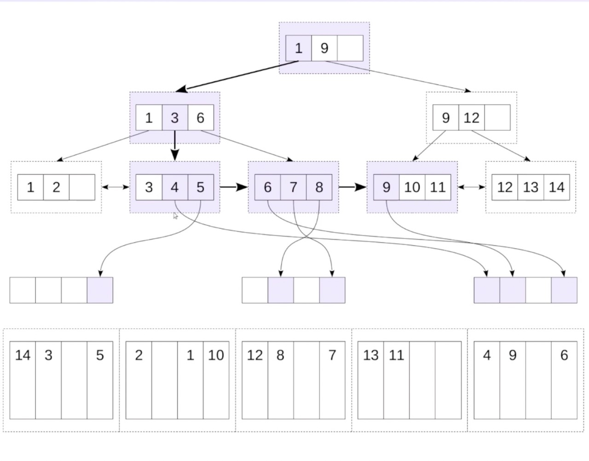

# Bitmap scan

## Table of contents

- [Bitmap scan](#bitmap-scan)
  - [Table of contents](#table-of-contents)
  - [Bitmap Index Scan. Bitmap Heap Scan](#bitmap-index-scan-bitmap-heap-scan)
  - [Объединение битовых карт](#объединение-битовых-карт)
  - [Parallel Bitmap Heap Scan](#parallel-bitmap-heap-scan)
  - [Неточные фрагменты](#неточные-фрагменты)
  - [Сравнение эффективности](#сравнение-эффективности)
  - [Кластеризация](#кластеризация)
  - [Итоги](#итоги)

## Bitmap Index Scan. Bitmap Heap Scan

Если на нужно выполнить поиск по диапазону от 4 до 9, то индексный доступ плох тем, что приходится хаотично читать табличные страницы — по несколько раз обращаться к одной и той же странице.

При доступе по битовой карте на первом этапе мы сканируем сам индекс, и не обращаемся к самой таблице: в локальной памяти процесса строим битовую карту, состоящую из отдельных фрагментов. Каждый фрагмент соответствует индексной странице, а биты внутри каждого фрагмента ссылаются на ту строку в табличной странице, которая подходит под условие запроса.



Вторым этапом мы выполняем сканирование по битовой карте, смотрим очередной фрагмент, заходим в табличную страницу, соответствующую этому фрагменту, и получаем из нее те табличные строки, которые подходят под условие. Таким образом на одной табличной странице мы можем найти несколько строчек, которые удовлетворяют условию. При этом одна табличная страница будет читаться только один раз.


Будем рассматривать таблицу бронирований bookings.

```bash
psql -U postgres
\c demo
\d bookings
```

```console
                        Table "bookings.bookings"
    Column    |           Type           | Collation | Nullable | Default 
--------------+--------------------------+-----------+----------+---------
 book_ref     | character(6)             |           | not null | 
 book_date    | timestamp with time zone |           | not null | 
 total_amount | numeric(10,2)            |           | not null | 
Indexes:
    "bookings_pkey" PRIMARY KEY, btree (book_ref)
Referenced by:
    TABLE "tickets" CONSTRAINT "tickets_book_ref_fkey" FOREIGN KEY (book_ref) REFERENCES bookings(book_ref)
```

Создадим на ней два дополнительных индекса:

```sql
CREATE INDEX book_date_test ON bookings (book_date);
```

```sql
CREATE INDEX total_amount_test ON bookings (total_amount);
```

Посмотрим, какой метод доступа будет выбран для поиска диапазона.

```sql
EXPLAIN
SELECT *
FROM bookings
WHERE total_amount < 10000;
```

```console
Bitmap Heap Scan on bookings  (cost=1219.51..15518.92 rows=64913 width=21)                   
  Recheck Cond: (total_amount < '10000'::numeric)                                            
  ->  Bitmap Index Scan on bookings_total_amount_idx  (cost=0.00..1203.28 rows=64913 width=0)
        Index Cond: (total_amount < '10000'::numeric)                                        
```

Выбран метод доступа Bitmap Scan. Он состоит из двух узлов:

- Bitmap Index Scan читает индекс и строит битовую карту;
- Bitmap Heap Scan читает табличные страницы, используя построенную карту.
Обратите внимание, что карта должна быть построена полностью, прежде чем ее можно будет использовать.

## Объединение битовых карт

Кроме того, что битовая карта позволяет избежать повторных чтений табличных страниц, с ее помощью можно объединять нескольких условий.

```sql
EXPLAIN (COSTS OFF)
SELECT *
FROM bookings
WHERE total_amount < 10000
   OR total_amount > 100000;
```

```console
Bitmap Heap Scan on bookings                                                             
  Recheck Cond: ((total_amount < '10000'::numeric) OR (total_amount > '100000'::numeric))
  ->  BitmapOr                                                                           
        ->  Bitmap Index Scan on total_amount_test                                       
              Index Cond: (total_amount < '10000'::numeric)                              
        ->  Bitmap Index Scan on total_amount_test                                       
              Index Cond: (total_amount > '100000'::numeric)                             
```

Здесь сначала были построены две битовые карты - по одной на каждое условие, а затем объединены побитовой операцией «или».

Таким же образом могут быть использованы и разные индексы.

```sql
EXPLAIN (COSTS OFF)
SELECT *
FROM bookings
WHERE total_amount < 10000
   OR book_date = bookings.now() - INTERVAL '1 day';
```

```console
Bitmap Heap Scan on bookings                                                                                                                 
  Recheck Cond: ((total_amount < '10000'::numeric) OR (book_date = ('2017-08-15 15:00:00+00'::timestamp with time zone - '1 day'::interval)))
  ->  BitmapOr                                                                                                                               
        ->  Bitmap Index Scan on total_amount_test                                                                                           
              Index Cond: (total_amount < '10000'::numeric)                                                                                  
        ->  Bitmap Index Scan on book_date_test                                                                                              
              Index Cond: (book_date = ('2017-08-15 15:00:00+00'::timestamp with time zone - '1 day'::interval))                             
```

## Parallel Bitmap Heap Scan

Сканирование по битовой карте может работать в параллельном режиме. Сколько бронирований сделано за последний месяц на сумму до 20 тысяч?

```sql
SELECT bookings.now() - INTERVAL '1 months' AS d;
```

```sql
EXPLAIN (COSTS OFF)
SELECT COUNT(*)
FROM bookings
WHERE total_amount < 20000
  AND book_date > '2017-07-15 15:00:00';
```

```console
Finalize Aggregate                                                                                    
  ->  Gather                                                                                          
        Workers Planned: 2                                                                            
        ->  Partial Aggregate                                                                         
              ->  Parallel Bitmap Heap Scan on bookings                                               
                    Recheck Cond: (book_date > '2017-07-15 15:00:00+00'::timestamp with time zone)    
                    Filter: (total_amount < '20000'::numeric)                                         
                    ->  Bitmap Index Scan on book_date_test                                           
                          Index Cond: (book_date > '2017-07-15 15:00:00+00'::timestamp with time zone)
```

Узел Bitmap Index Scan выполняется ведущим процессом, который строит битовую карту. Параллельно выполняется только сканирование таблицы по уже готовой битовой карте — узел Parallel Bitmap Heap Scan.

## Неточные фрагменты

Битовая карта без потери точности строится пока размер карты не превышает `work_mem`, информация хранится с точностью до версии строки.

Битовая карта с потерей точности строится если память закончилась, происходит огрубление части уже построенной карты до отдельных страниц. Требуется примерно 1 МБ памяти на 64 ГБ данных; ограничение памяти может быть превышено.

Битовая карта всегда располагается в оперативной памяти. Временные файлы на диске для битовой карты никогда не создаются.

Узел Bitmap Heap Scan показывает условие перепроверки (Recheck Cond). Сама же перепроверка выполняется не всегда, а только при потере точности, когда битовая карта не помещается в память.

Повторим запрос, изменив условие для получения бронирований до 10 тысяч:

```sql
SELECT bookings.now() - INTERVAL '1 months' AS d;
```

```sql
EXPLAIN (ANALYZE, COSTS OFF, TIMING OFF )
SELECT COUNT(*)
FROM bookings
WHERE total_amount < 10000
  AND book_date > '2017-07-15 15:00:00';
```

```console
Aggregate (actual rows=1 loops=1)                                                                                             
  ->  Bitmap Heap Scan on bookings (actual rows=5386 loops=1)                                                                 
        Recheck Cond: ((total_amount < '10000'::numeric) AND (book_date > '2017-07-15 15:00:00+00'::timestamp with time zone))
        Heap Blocks: exact=4413                                                                                               
        ->  BitmapAnd (actual rows=0 loops=1)                                                                                 
              ->  Bitmap Index Scan on total_amount_test (actual rows=63944 loops=1)                                          
                    Index Cond: (total_amount < '10000'::numeric)                                                             
              ->  Bitmap Index Scan on book_date_test (actual rows=178142 loops=1)                                            
                    Index Cond: (book_date > '2017-07-15 15:00:00+00'::timestamp with time zone)                              
Planning Time: 0.169 ms                                                                                                       
Execution Time: 26.465 ms           
```

Строка «Heap Blocks: exact» говорит о том, что все фрагменты битовой карты построены с точностью до строк — перепроверка не выполняется.

Уменьшим размер выделяемой памяти.

```sql
SET WORK_MEM = '64kB';
```

```console
Finalize Aggregate (actual rows=1 loops=1)                                                                                                
  ->  Gather (actual rows=3 loops=1)                                                                                                      
        Workers Planned: 2                                                                                                                
        Workers Launched: 2                                                                                                               
        ->  Partial Aggregate (actual rows=1 loops=3)                                                                                     
              ->  Parallel Bitmap Heap Scan on bookings (actual rows=1795 loops=3)                                                        
                    Recheck Cond: ((total_amount < '10000'::numeric) AND (book_date > '2017-07-15 15:00:00+00'::timestamp with time zone))
                    Rows Removed by Index Recheck: 648741                                                                                 
                    Heap Blocks: exact=303 lossy=4241                                                                                     
                    ->  BitmapAnd (actual rows=0 loops=1)                                                                                 
                          ->  Bitmap Index Scan on total_amount_test (actual rows=63944 loops=1)                                          
                                Index Cond: (total_amount < '10000'::numeric)                                                             
                          ->  Bitmap Index Scan on book_date_test (actual rows=178142 loops=1)                                            
                                Index Cond: (book_date > '2017-07-15 15:00:00+00'::timestamp with time zone)                              
Planning Time: 0.160 ms                                                                                                                   
Execution Time: 116.360 ms                                                                                                                
```

Здесь появились lossy-фрагменты битовой карты - с точностью до страниц. Также указано, сколько строк не прошло перепроверку условия (Rows Removed by Index Recheck).

Планировщик переключился на параллельный план, поскольку стоимость сканирования по битовой карте (теперь неточной) увеличилась.

Восстановим значение параметра.

```sql
RESET WORK_MEM;
```

## Сравнение эффективности


Все это относится к таблицам, размер которых чуть больше, чем совсем маленький — они должны иметь хотя бы несколько страниц данных, чтобы чтение индекса имело смысл.

## Кластеризация

Если строки таблицы упорядочены так же, как и индекс, битовая карта становится излишней. Продемонстрируем это с помощью команды `CLUSTER`.

Сейчас строки таблицы физически упорядочены по номеру бронирования:

```sql
SELECT *
FROM bookings
LIMIT 10;
```

```console
|00000F  |2017-07-05 00:12:00.000000 +00:00|265700.00   |
|000010  |2017-01-08 16:45:00.000000 +00:00|50900.00    |
|000012  |2017-07-14 06:02:00.000000 +00:00|37900.00    |
|000026  |2016-08-30 08:08:00.000000 +00:00|95600.00    |
|00002D  |2017-05-20 15:45:00.000000 +00:00|114700.00   |
|000034  |2016-08-08 02:46:00.000000 +00:00|49100.00    |
|00003F  |2016-12-12 12:02:00.000000 +00:00|109800.00   |
|000048  |2016-09-16 22:57:00.000000 +00:00|92400.00    |
|00004A  |2016-10-13 18:57:00.000000 +00:00|29000.00    |
|000050  |2016-09-17 21:01:00.000000 +00:00|36200.00    |
```

Переупорядочим строки в соответствии с индексом по столбцу `total_amount`.

Пока идет процесс, обратите внимание:

- Команда `CLUSTER` устанавливает исключительную блокировку, поскольку полностью перестраивает таблицу (как `VACUUM FULL`) 
- Строки упорядочиваются, но не поддерживаются в упорядоченном виде - в процессе работы кластеризация будет ухудшаться

```sql
CLUSTER bookings USING total_amount_test;
```

```sql
SELECT *
FROM bookings
LIMIT 10;
```

```console
|00F39E  |2017-02-12 01:11:00.000000 +00:00|3400.00     |
|0103E1  |2017-04-03 06:32:00.000000 +00:00|3400.00     |
|013695  |2016-11-01 06:30:00.000000 +00:00|3400.00     |
|0158C0  |2017-04-24 04:47:00.000000 +00:00|3400.00     |
|01AD57  |2017-03-15 13:11:00.000000 +00:00|3400.00     |
|020E97  |2017-01-02 09:25:00.000000 +00:00|3400.00     |
|021FD3  |2017-05-27 07:20:00.000000 +00:00|3400.00     |
|0278C7  |2017-02-04 14:42:00.000000 +00:00|3400.00     |
|029452  |2016-12-10 10:51:00.000000 +00:00|3400.00     |
|0355DD  |2016-09-19 10:22:00.000000 +00:00|3400.00     |
```

Соберем статистику.

```sql
ANALYZE bookings;
```

Сбор статистики позволяет, в том числе, оценить степень кластеризации.

```sql
EXPLAIN
SELECT *
FROM bookings
WHERE total_amount < 10000;
```

```console
Index Scan using total_amount_test on bookings  (cost=0.43..2182.48 rows=62460 width=21)
  Index Cond: (total_amount < '10000'::numeric)                                         
```

До кластеризации использовалось сканирование по битовой карте, но теперь проще и выгодней сделать обычное индексное сканирование.


## Итоги

Сканирование по битовой карте:

- исключает повторное чтение табличных страниц
- позволяет объединять несколько индексов
- эффективно при средней селективности

Несколько методов доступа позволяют планировщику выбрать лучший, учитывая различные факторы:

- селективность условия
- необходимость обращаться к таблице и карту видимости соответствие порядка данных в таблице и в индексе - необходимость получить отсортированную выборку
- потребность быстрого получения первых результатов и другие
  