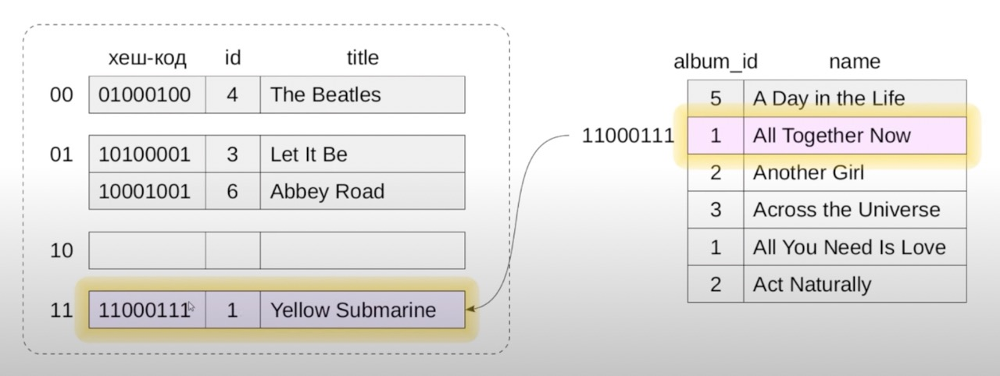

# Hash joins

## Table of contents

- [Hash joins](#hash-joins)
  - [Table of contents](#table-of-contents)
  - [One-pass hash joins](#one-pass-hash-joins)
    - [Группировка и уникальные значения](#группировка-и-уникальные-значения)
    - [Использование памяти](#использование-памяти)
  - [Two-pass hash joins](#two-pass-hash-joins)
  - [Вычислительная сложность](#вычислительная-сложность)

## One-pass hash joins

Однопроходное соединение применяется тогда, когда оперативной памяти достаточно, чтобы построить хеш-таблицу.

```sql
SELECT a.title, s.name
FROM albums
         JOIN songs s ON a.id = s.album_id;
```

Помимо идентификатора условия соединения внутри хеш-таблицы также должны находиться все столбцы, которые используются в запросе. Столбце `title` (левый рисунок), нам потребуется для результата, поэтому он точно также должен быть помещен в хеш-таблицу (правый рисунок). Столбец `year` не нужен в результатах запроса, поэтому он в хеш-таблицу помещаться не будет.


Размер хеш-таблицы вычисляется по формуле [↑ `work_mem`](https://www.postgresql.org/docs/current/runtime-config-resource.html#GUC-WORK-MEM) $\times$ [↑ `hash_mem_multiplier`](https://www.postgresql.org/docs/current/runtime-config-resource.html#GUC-HASH-MEM-MULTIPLIER).

После того, как хеш-таблица построена, мы читаем второй, внешний, набор строк (правый рисунок), и для каждой строки вычисляем хеш-код. Далее по хеш-коду идем в соответствующее ведро хеш-таблицы и проверяем условие соединения.



Для большой выборки оптимизатор предпочитает соединение хешированием:

```sql
EXPLAIN (COSTS OFF)
SELECT *
FROM tickets t
         JOIN ticket_flights tf ON tf.ticket_no = t.ticket_no;
```

```console
Hash Join
  Hash Cond: (tf.ticket_no = t.ticket_no)
  ->  Seq Scan on ticket_flights tf
  ->  Hash
        ->  Seq Scan on tickets t
```

В данном случае хеш-таблица строится по таблице `tickets`. Далее последовательным сканированием читаем таблицу `ticket_flights` и ищем в хеш-таблице нужные номера билетов.

Модификации Hash Join включают уже рассмотренные ранее Left (Right), Semi и Anti, а также Full для полного соединения:

```sql
EXPLAIN
SELECT *
FROM aircrafts a
FULL JOIN seats s ON a.aircraft_code = s.aircraft_code;
```

```console
Hash Full Join  (cost=3.47..30.04 rows=1339 width=67)
  Hash Cond: (s.aircraft_code = ml.aircraft_code)
  ->  Seq Scan on seats s  (cost=0.00..21.39 rows=1339 width=15)
  ->  Hash  (cost=3.36..3.36 rows=9 width=52)
        ->  Seq Scan on aircrafts_data ml  (cost=0.00..3.36 rows=9 width=52)
```

### Группировка и уникальные значения

Для группировки (`GROUP BY`) и устранения дубликатов (`DISTINCT` и операции со множествами без слова `ALL`) используются методы, схожие с методами соединения. Один из способов выполнения состоит в том, чтобы построить хеш-таблицу по нужным полям и получить из нее уникальные значения.

```sql
EXPLAIN
SELECT fare_conditions, COUNT(*)
FROM seats
GROUP BY fare_conditions;
```

```console
HashAggregate  (cost=28.09..28.12 rows=3 width=16)
  Group Key: fare_conditions
  ->  Seq Scan on seats  (cost=0.00..21.39 rows=1339 width=8)
```

То же самое и с DISTINCT:

```sql
EXPLAIN
SELECT DISTINCT fare_conditions
FROM seats;
```

```console
HashAggregate  (cost=24.74..24.77 rows=3 width=8)
  Group Key: fare_conditions
  ->  Seq Scan on seats  (cost=0.00..21.39 rows=1339 width=8)
```

### Использование памяти

Размер доступной памяти — 8 MB:

```sql
SELECT wm.setting                                  work_mem,
       wm.unit,
       hmm.setting                                 hash_mem_multiplier,
       wm.setting:: numeric * hmm.setting::numeric total
FROM pg_settings wm,
     pg_settings hmm
WHERE wm.name = 'work_mem'
  AND hmm.name = 'hash_mem_multiplier';
```

```console
+--------+----+-------------------+-----+
|work_mem|unit|hash_mem_multiplier|total|
+--------+----+-------------------+-----+
|4096    |kB  |2                  |8192 |
+--------+----+-------------------+-----+
```

Увеличим размер памяти, отведенной под хеш-таблицу:

```sql
SET work_mem = '64MB';
SET hash_mem_multiplier = 3;
```

Теперь размер ограничен 196 MB:

```console
+--------+----+-------------------+------+
|work_mem|unit|hash_mem_multiplier|total |
+--------+----+-------------------+------+
|65536   |kB  |3                  |196608|
+--------+----+-------------------+------+
```

Команда `EXPLAIN` показывает нестандартные значения параметров при указании `settings`:

```sql
EXPLAIN (ANALYZE, SETTINGS, COSTS OFF, TIMING OFF, SUMMARY OFF)
SELECT *
FROM bookings b
         JOIN tickets t ON b.book_ref = t.book_ref;
```

```console
Hash Join (actual rows=2949857 loops=1)
  Hash Cond: (t.book_ref = b.book_ref)
  ->  Seq Scan on tickets t (actual rows=2949857 loops=1)
  ->  Hash (actual rows=2111110 loops=1)
        Buckets: 4194304  Batches: 1  Memory Usage: 145986kB
        ->  Seq Scan on bookings b (actual rows=2111110 loops=1)
Settings: search_path = 'bookings, public', work_mem = '64MB', hash_mem_multiplier = '3'
```

Хеш-таблица поместилась в память (Batches: 1). Параметр `Buckets` показывает число корзин в хеш-таблице, а `Memory Usage` — использованную оперативную память.

Обратите внимание, что хеш-таблица строилась по меньшему набору строк — таблице `bookings`.

Сравним с таким же запросом, который выводит только одно поле:

```sql
EXPLAIN (ANALYZE, COSTS OFF, TIMING OFF, SUMMARY OFF)
SELECT b.book_ref
FROM bookings b
         JOIN tickets t ON b.book_ref = t.book_ref;
```

```console
Hash Join (actual rows=2949857 loops=1)
  Hash Cond: (t.book_ref = b.book_ref)
  ->  Seq Scan on tickets t (actual rows=2949857 loops=1)
  ->  Hash (actual rows=2111110 loops=1)
        Buckets: 4194304  Batches: 1  Memory Usage: 113172kB
        ->  Seq Scan on bookings b (actual rows=2111110 loops=1)
```

Расход памяти уменьшился, так как в хеш-таблице теперь только одно поле (вместо трех).

Обратите внимание на строку `Hash Cond`: она содержит предикаты, участвующие в соединении. Условие может включать и такие предикаты, которые не могут использоваться механизмом соединения, но должны учитываться. Они отображаются в отдельной строке `Join Filter`, и нужные для их вычисления поля тоже попадают в хеш-таблицу (сравните объем памяти, он увеличился) :

```sql
EXPLAIN (ANALYZE, COSTS OFF, TIMING OFF, SUMMARY OFF)
SELECT b.book_ref
FROM bookings b
         JOIN tickets t ON b.book_ref = t.book_ref
    AND b.total_amount::TEXT > t.passenger_id;
```

```console
Hash Join (actual rows=1198320 loops=1)
  Hash Cond: (t.book_ref = b.book_ref)
  Join Filter: ((b.total_amount)::text > (t.passenger_id)::text)
  Rows Removed by Join Filter: 1751537
  ->  Seq Scan on tickets t (actual rows=2949857 loops=1)
  ->  Hash (actual rows=2111110 loops=1)
        Buckets: 4194304  Batches: 1  Memory Usage: 127431kB
        ->  Seq Scan on bookings b (actual rows=2111110 loops=1)
```

## Two-pass hash joins

Применяется, когда хеш-таблица не помещается в оперативную память: наборы данных разбиваются на пакеты и последовательно соединяются.

Теперь уменьшим ограничение памяти так, чтобы хеш-таблица не поместилась, и выведем статистику использования буферного кеша:

```sql
SET work_mem = '32MB';
SET hash_mem_multiplier = 1;
```

```sql
EXPLAIN (ANALYZE, BUFFERS, COSTS OFF, TIMING OFF, SUMMARY OFF)
SELECT b.book_ref
FROM bookings b
         JOIN tickets t ON b.book_ref = t.book_ref;
```

```console
Hash Join (actual rows=2949857 loops=1)                            
  Hash Cond: (t.book_ref = b.book_ref)                             
  Buffers: shared hit=871 read=62016, temp read=12515 written=12515
  ->  Seq Scan on tickets t (actual rows=2949857 loops=1)          
        Buffers: shared hit=449 read=48991                         
  ->  Hash (actual rows=2111110 loops=1)                           
        Buckets: 1048576  Batches: 4  Memory Usage: 28291kB        
        Buffers: shared hit=422 read=13025, temp written=5217      
        ->  Seq Scan on bookings b (actual rows=2111110 loops=1)   
              Buffers: shared hit=422 read=13025                   
Planning:                                                          
  Buffers: shared hit=8                                            
```

Теперь потребовалось четыре пакета (Batches: 4).

Видно, что узел `Hash` записывает пакеты во временные файлы (`temp written`), а узел `Hash Join` и записывает, и читает (`temp read` и `written`).

## Вычислительная сложность

Вычислительная сложность соединения хеш-таблицей приблизительно равна `N` + `M`, где `N` и `M` — число строк в первом и втором наборах данных.

При соединении таким образом имеются начальные затраты на построение хеш-таблицы, поэтому данный вид соединения хорош в OLAP-системах, так как нам не нужно быстро получать первые строки.

Данный тип соединения эффективен для большого числа строк.
