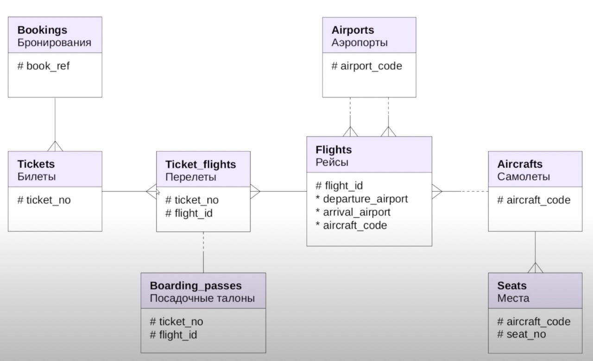

# Air transportation database

Run Postgres with [docker-compose.yaml](docker-compose.yaml) file:

```bash
docker-compose up --detach
```

Restore database:

```bash
cat /Users/aleksei/Downloads/demo-big-20170815.sql | docker exec --interactive air-transportation \
psql -U postgres
```

Common diagram:



## Table of contents

- [Air transportation database](#air-transportation-database)
  - [Table of contents](#table-of-contents)
  - [Tables, functions](#tables-functions)
    - [`bookings`](#bookings)
    - [`now` (function)](#now-function)
    - [`tickets`](#tickets)
    - [`tickets_flights`](#tickets_flights)
    - [`flights`](#flights)
    - [`airports`](#airports)
    - [`aircrafts`](#aircrafts)
    - [`seats`](#seats)
    - [`boarding_passes`](#boarding_passes)

## Tables, functions

### `bookings`

```sql
SELECT *
FROM bookings
WHERE book_ref = '0824C5';
```

| book_ref | book_date                         | total_amount |
| :------- | :-------------------------------- | :----------- |
| 0824C5   | 2017-07-25 20:36:00.000000 +00:00 | 112400.00    |

|                |                |                                           |
| -------------- | -------------- | ----------------------------------------- |
| _Booking code_ | _Booking date_ | _Total sum of all tickets inside booking_ |

### `now` (function)

```sql
SELECT bookings.now();
```

| now                               |
| :-------------------------------- |
| 2017-08-15 15:00:00.000000 +00:00 |

```sql
SELECT bookings.now() - b.book_date AS "Date difference"
FROM bookings b
WHERE b.book_ref = '0824C5';
```

| Date difference                                  |
| :----------------------------------------------- |
| 0 years 0 mons 20 days 18 hours 24 mins 0.0 secs |

### `tickets`

| Column | Description |
| ------ | ----------- |
|        |             |
|        |             |
|        |             |
|        |             |
|        |             |

### `tickets_flights`

| Column | Description |
| ------ | ----------- |
|        |             |
|        |             |
|        |             |
|        |             |

### `flights`

| Column | Description |
| ------ | ----------- |
|        |             |
|        |             |
|        |             |
|        |             |
|        |             |
|        |             |
|        |             |

### `airports`

| Column | Description |
| ------ | ----------- |
|        |             |
|        |             |
|        |             |
|        |             |
|        |             |

### `aircrafts`

| Column | Description |
| ------ | ----------- |
|        |             |
|        |             |
|        |             |
|        |             |
|        |             |

### `seats`

| Column | Description |
| ------ | ----------- |
|        |             |
|        |             |
|        |             |

### `boarding_passes`

| Column | Description |
| ------ | ----------- |
|        |             |
|        |             |
|        |             |
|        |             |
