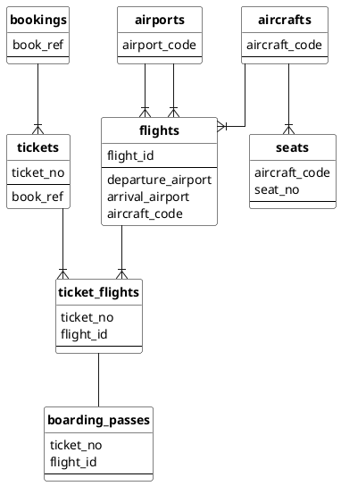

# Air transportation database

## Table of contents

- [Air transportation database](#air-transportation-database)
  - [Table of contents](#table-of-contents)
  - [Installation](#installation)
  - [Common diagram](#common-diagram)
  - [Tables, functions](#tables-functions)
    - [`bookings`](#bookings)
    - [`now` (function)](#now-function)
    - [`tickets`](#tickets)
    - [`tickets_flights`](#tickets_flights)
    - [`flights`](#flights)
    - [`airports`](#airports)
    - [`aircrafts`](#aircrafts)
    - [`seats`](#seats)
    - [`boarding_passes`](#boarding_passes)

## Installation

Run Postgres with [docker-compose.yaml](docker-compose.yaml) file:

```bash
docker-compose up --detach
```

Restore [↑ demo database](https://postgrespro.com/community/demodb):

```bash
cat ~/Downloads/demo-big-20170815.sql | docker exec --interactive air-transportation \
psql -U postgres
```

## Common diagram




## Tables, functions

### `bookings`

```sql
SELECT *
FROM bookings
WHERE book_ref = '0824C5';
```

| book_ref | book_date                         | total_amount |
| :------- | :-------------------------------- | :----------- |
| 0824C5   | 2017-07-25 20:36:00.000000 +00:00 | 112400.00    |

|                |                |                                           |
| -------------- | -------------- | ----------------------------------------- |
| _Booking code_ | _Booking date_ | _Total sum of all tickets inside booking_ |

### `now` (function)

```sql
SELECT bookings.now();
```

| now                               |
| :-------------------------------- |
| 2017-08-15 15:00:00.000000 +00:00 |

```sql
SELECT bookings.now() - b.book_date AS "Date difference"
FROM bookings b
WHERE b.book_ref = '0824C5';
```

| Date difference                                  |
| :----------------------------------------------- |
| 0 years 0 mons 20 days 18 hours 24 mins 0.0 secs |

### `tickets`

```sql
SELECT t.*
FROM bookings b
         JOIN tickets t ON b.book_ref = t.book_ref
WHERE b.book_ref = '0824C5';
```

| ticket_no     | book_ref | passenger_id | passenger_name    | contact_data              |
| :------------ | :------- | :----------- | :---------------- | :------------------------ |
| 0005435126781 | 0824C5   | 7247 393204  | ALEKSANDR MATVEEV | {"phone": "+70095062310"} |
| 0005435126782 | 0824C5   | 1745 826066  | NINA KRASNOVA     | {"phone": "+70876976071"} |

### `tickets_flights`

```sql
SELECT tf.*
FROM tickets t
         JOIN ticket_flights tf ON t.ticket_no = tf.ticket_no
WHERE t.ticket_no = '0005435126781';
```

| ticket_no     | flight_id | fare_conditions | amount   |
| :------------ | :-------- | :-------------- | :------- |
| 0005435126781 | 22566     | Economy         | 11700.00 |
| 0005435126781 | 71439     | Economy         | 3200.00  |
| 0005435126781 | 74643     | Economy         | 8800.00  |
| 0005435126781 | 94335     | Economy         | 11700.00 |
| 0005435126781 | 95726     | Economy         | 3200.00  |
| 0005435126781 | 206625    | Business        | 26400.00 |

### `flights`

```sql
SELECT tf.*
FROM tickets t
         JOIN ticket_flights tf ON t.ticket_no = tf.ticket_no
WHERE t.ticket_no = '0005435126781';
```

| flight_id | scheduled_departure               | departure_airport | arrival_airport | status    | aircraft_code |
| :-------- | :-------------------------------- | :---------------- | :-------------- | :-------- | :------------ |
| 22566     | 2017-08-12 08:00:00.000000 +00:00 | VKO               | PEE             | Arrived   | 773           |
| 95726     | 2017-08-12 12:30:00.000000 +00:00 | PEE               | SVX             | Arrived   | SU9           |
| 74643     | 2017-08-13 08:30:00.000000 +00:00 | SVX               | SGC             | Arrived   | SU9           |
| 206625    | 2017-08-15 11:45:00.000000 +00:00 | SGC               | SVX             | Departed  | SU9           |
| 71439     | 2017-08-16 05:50:00.000000 +00:00 | SVX               | PEE             | On Time   | SU9           |
| 94335     | 2017-08-16 15:55:00.000000 +00:00 | PEE               | VKO             | Scheduled | 773           |

```sql
SELECT *
FROM flights
WHERE flight_id = 22566;
```

| flight_id | flight_no | scheduled_departure               | scheduled_arrival                 | departure_airport | arrival_airport | status  | aircraft_code | actual_departure                  | actual_arrival                    |
| :-------- | :-------- | :-------------------------------- | :-------------------------------- | :---------------- | :-------------- | :------ | :------------ | :-------------------------------- | :-------------------------------- |
| 22566     | PG0412    | 2017-08-12 08:00:00.000000 +00:00 | 2017-08-12 09:25:00.000000 +00:00 | VKO               | PEE             | Arrived | 773           | 2017-08-12 08:01:00.000000 +00:00 | 2017-08-12 09:25:00.000000 +00:00 |

```sql
SELECT f.flight_id, f.flight_no, f.scheduled_departure
FROM flights f
WHERE f.flight_no = 'PG0412'
ORDER BY f.scheduled_departure
LIMIT 10;
```

| flight_id | flight_no | scheduled_departure               |
| :-------- | :-------- | :-------------------------------- |
| 22784     | PG0412    | 2016-08-15 08:00:00.000000 +00:00 |
| 22746     | PG0412    | 2016-08-16 08:00:00.000000 +00:00 |
| 22721     | PG0412    | 2016-08-17 08:00:00.000000 +00:00 |
| 22691     | PG0412    | 2016-08-18 08:00:00.000000 +00:00 |
| 22749     | PG0412    | 2016-08-19 08:00:00.000000 +00:00 |
| 22508     | PG0412    | 2016-08-20 08:00:00.000000 +00:00 |
| 22493     | PG0412    | 2016-08-21 08:00:00.000000 +00:00 |
| 22496     | PG0412    | 2016-08-22 08:00:00.000000 +00:00 |
| 22483     | PG0412    | 2016-08-23 08:00:00.000000 +00:00 |
| 22501     | PG0412    | 2016-08-24 08:00:00.000000 +00:00 |

### `airports`

```sql

```

### `aircrafts`

```sql

```

### `seats`

```sql

```

### `boarding_passes`

```sql

```
