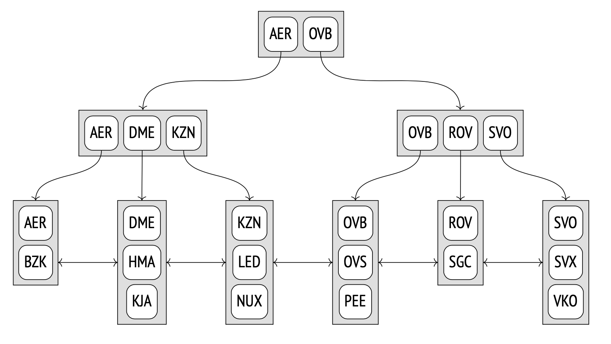

# Types of indexes

## Table of contents

- [Types of indexes](#types-of-indexes)
  - [Table of contents](#table-of-contents)
  - [Hash](#hash)
  - [B-tree](#b-tree)

## Hash

A **hash index** provides the ability to quickly find a tuple ID (TID) by a particular index key. Roughly speaking, it is simply a hash table stored on disk. The only operation supported by a hash index is search by the equality condition.

## B-tree

A **B-tree** is a data structure that enables you to quickly find the required element in leaf nodes of the tree by going down from its root. For the search path to be unambiguously identified, all tree elements must be ordered. B-trees are designed for ordinal data types, whose values can be compared and sorted.

The following schematic diagram of an index build over airport codes shows inner nodes as horizontal rectangles; leaf nodes are aligned vertically.

Each tree node contains several elements, which consist of an index key and a pointer. Inner node elements reference nodes of the next level; leaf node elements reference heap tuples (the illustration does not show these references).

B-trees have the following important properties:

- They are balanced, which means that all leaf nodes of a tree are located at the same depth. Therefore, they guarantee equal search time for all values.
- They have plenty of branches, that is, each node contains many elements, often hundreds of them (the illustration shows three-element nodes solely for clarity). As a result, B-tree depth is always small, even for very large tables.
- Data in an index is sorted either in ascending or in descending order, both within each node and across all nodes of the same level. Peer nodes are bound into a bidirectional list, so it is possible to get an ordered set of data by simply scanning the list one way or the other, without having to start at the root each time.

We cannot say with absolute certainty what the letter B in the name of this structure stands for. Both *balanced* and *bushy* fit equally well. Surprisingly, you can often see it interpreted as *binary*, which is certainly incorrect.

[↑ B-Tree индекс и его производные в PostgreSQL](https://habr.com/ru/companies/quadcode/articles/696498/).
