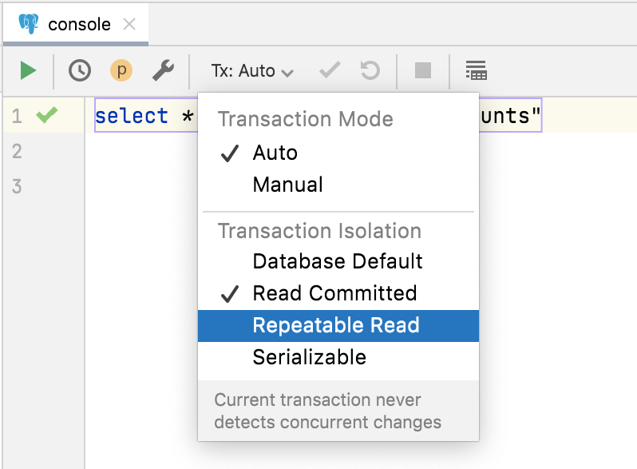

# Read Phenomena and Isolation Levels

- [Read Phenomena and Isolation Levels](#read-phenomena-and-isolation-levels)
  - [Read phenomena](#read-phenomena)
    - [Dirty reads](#dirty-reads)
    - [Non-repeatable reads](#non-repeatable-reads)
    - [Phantom reads](#phantom-reads)
  - [Isolation levels](#isolation-levels)
    - [Read uncommitted](#read-uncommitted)
    - [Read committed](#read-committed)
    - [Repeatable read](#repeatable-read)
    - [Serializable](#serializable)
  - [DataGrip](#datagrip)
  - [Links](#links)

An **isolation level** represents a particular locking strategy employed in the database system to avoid _read phenomena_.

## Read phenomena

### Dirty reads

A **dirty read** is a phenomenon that occurs when a transaction is allowed to read data from a row that has been modified by another running transaction and not yet committed.

```text
User 1 modifies a row.
User 2 reads the same row before User 1 commits.
User 1 performs a rollback.
User 2 has read row's values that have never really existed in the database.
```

### Non-repeatable reads

A **non-repeatable read** is a phenomenon that occurs when, during the course of a transaction, a row is retrieved twice and the values within the row differ between reads.

```text
User 1 reads a row, but does not commit.
User 2 modifies or deletes the same row and then commits.
User 1 rereads the row and finds it has been changed.
```

### Phantom reads

A **phantom read** is a phenomenon that occurs when, in the course of a transaction, new rows are added or removed by another transaction to the records being read.

```text
User 1 uses a search condition to read a set of rows, but does not commit.
User 2 inserts one or more rows that satisfy this search condition, then commits.
User 1 rereads the rows using the search condition and discovers rows that were not present before.
```

## Isolation levels

The American National Standards Institute (ANSI) defines four isolation levels:

- Read uncommitted
- Read committed
- Repeatable read
- Serializable

See 1995 article: [A Critique of ANSI SQL Isolation Levels](tr-95-51.pdf).

The plus sign `+` reads as "phenomenon can happen":

| Isolation level  | Phantom reads | Non-repeatable reads | Dirty reads |
| ---------------- | ------------- | -------------------- | ----------- |
| Read uncommitted | +             | +                    | +           |
| Read committed   | +             | +                    | -           |
| Repeatable read  | +             | -                    | -           |
| Serializable     | -             | -                    | -           |

Although higher isolation levels provide better data consistency, this consistency can be costly in terms of the parallel access provided to users. As isolation level increases, so does the chance that the locking strategy used will create problems with parallel access of data.

### Read uncommitted

Locks are obtained on modifications to the database and held until end of transaction (EOT). Reading from the database does not involve any locking.

### Read committed

Locks are acquired for reading and modifying the database. Locks are released after reading but locks on modified objects are held until EOT.

### Repeatable read

Locks are obtained for reading and modifying the database. Locks on all modified objects are held until EOT. Locks obtained for reading data are held until EOT. Locks on non-modified access structures (such as indexes and hashing structures) are released after reading.

### Serializable

All data read or modified is locked until EOT. All access structures that are modified are locked until EOT. Access structures used by the query are locked until EOT.

## DataGrip

Selection isolation level in DataGrip:



## Links

[↑ Deeply understand Isolation levels and Read phenomena in MySQL & PostgreSQL](https://dev.to/techschoolguru/understand-isolation-levels-read-phenomena-in-mysql-postgres-c2e)
