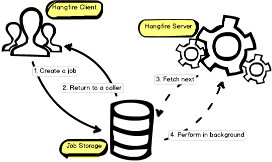

# Hangfire

[↑ Hangfire](https://www.hangfire.io) is an open-source framework that can be used to perform background processing in .NET applications.

Hangfire can be considered as a state machine for *background jobs*.

[↑ GitHub repository](https://github.com/HangfireIO/Hangfire).

## Table of contents

- [Hangfire](#hangfire)
  - [Table of contents](#table-of-contents)
  - [Overview](#overview)
  - [Usage scenarios](#usage-scenarios)
  - [Background jobs](#background-jobs)
  - [States](#states)
  - [Configuration](#configuration)
  - [Using SQL Server for storage](#using-sql-server-for-storage)
  - [Features](#features)
    - [Persistence](#persistence)
    - [Transparent](#transparent)
    - [Reliability](#reliability)
    - [Distributed processing](#distributed-processing)
    - [Efficient](#efficient)
    - [Self-maintainable](#self-maintainable)
  - [ASP.NET Core installation](#aspnet-core-installation)

## Overview

Hangfire allows to kick off method calls outside of the request processing pipeline in easy, but *reliable* way. These method invocations are performed in a background thread and called *background jobs*.

The library consists of three main components: *client*, *storage* and *server*:



Hangfire allows to perform *fire-and-forget*, *delayed*, *recurring*, *continuation* and *batches* jobs inside ASP.NET applications. CPU and I/O intensive, long-running and short-running jobs are supported.

**Fire-and-forget tasks** are background jobs that are executed by dedicated worker pool threads as soon as possible.

**Delayed tasks** are scheduled background jobs that are executed only after a given amount of time.

**Recurring tasks** are scheduled background jobs are executed only after a given amount of time.

**Continuations tasks** are background jobs that are executed when its parent job has been finished.

## Usage scenarios

- Mass notifications/newsletters
- Batch import from XML, CSV or JSON
- Creation of archives
- Firing off web hooks
- Deleting users
- Building different graphs
- Image/video processing
- Purging temporary files
- Recurring automated reports
- Database maintenance
- …and so on

## Background jobs

A **background jobs** in Hangfire looks like regular method calls. Most of its interfaces are using expression trees to define what method should be called and with what arguments.

The purpose of the method calls is to collect and serialize the following information:

- Type name, including namespace and assembly
- Method name and its parameter types
- Argument values

Serialization is performed by the `Newtonsoft.Json` package and resulting JSON is persisted in a storage making it available for other processes.

## States

Each background job has a specific **state** associated with it at every moment in time that defines how and when it will be processed. There is a bunch of built-in states like:

- `Enqueued`
- `Scheduled`
- `Awaiting`
- `Processing`
- `Failed`
- `Succeeded`
- `Deleted`

Custom states can be implemented as well.

During background processing, background jobs are moved from one state into another with executing some side effects. So Hangfire can be considered as a state machine for background jobs. Processed background jobs end in a final state (only `Succeeded` and `Deleted` built-in states, but not the `Failed` one) and will be expired automatically after 24 hours by default.

Expiration time can be configured globally by calling the `WithJobExpirationTimeout` method. This method should be called after the `UseXXXStorage` ones:

```csharp
GlobalConfiguration.Configuration
    .UseXXXStorage(/* ... */)
    .WithJobExpirationTimeout(TimeSpan.FromHours(6));
```

## Configuration

Starting from version 1.4, `GlobalConfiguration` class is the preferred way to configure Hangfire. This is an entry point for a couple of methods, including ones from third-party storage implementations or other extensions.

## Using SQL Server for storage

SQL Server is the default storage for Hangfire — it is well known to many .NET developers and used in many project environments. It might be interesting that in the early stage of Hangfire development, Redis was used to store information about jobs, and SQL Server storage implementation was inspired by that NoSQL solution.

[↑ Using SQL Server](https://docs.hangfire.io/en/latest/configuration/using-sql-server.html).

## Features

### Persistence

Background jobs are created in a persistent storage – SQL Server and Redis supported officially, and a lot of other community-driven storages.

You can safely restart your application and use Hangfire with ASP.NET without worrying about application pool recycles.

### Transparent

Built-in web interface allow you to see the whole picture of your background processing, as well as observe the state of each background job.

### Reliability

Once a background job was created without any exception, Hangfire takes the responsibility to process it with the at least once semantics.

You are free to throw unhandled exceptions or terminate your application – background jobs will be re-tried automatically.

### Distributed processing

Background method calls and their arguments are serialized and may overcome the process boundaries.

You can use Hangfire on different machines to get more processing power with no configuration – synchronization is performed automatically.

### Efficient

Although the default installation uses SQL Server and polling technique to fetch jobs, you can leverage MSMQ or Redis extensions to reduce the processing latency to minimum.

### Self-maintainable

You don't need to perform manual storage clean-up — Hangfire keeps it as clean as possible and removes old records automatically.

## ASP.NET Core installation

```bash
dotnet add package Hangfire.AspNetCore
dotnet add package Hangfire.SqlServer
```

```sql
CREATE DATABASE HangfireTest
GO


[↑ ASP.NET Core Applications](https://docs.hangfire.io/en/latest/getting-started/aspnet-core-applications.html)
