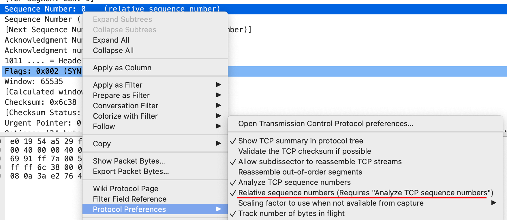

# Wireshark

Anytime you see a value inside square brackets — it's a Wireshark's value, that's not part of the data, it's something that Wireshark does to help us interpret what we are seeing.

`[Stream index: 0]` — The number of a stream of any kind. If you see in the trace file a `SYN` and another `SYN` right after it on a different port number — that would be a stream 0 and a stream 1. So you can quickly spot how many different TCP streams you have in trace.

`[TCP Segment Len: 0]` — how much data is in this packet that you are sending.

`Sequence number` — Wireshark will start off sequence number at 0 for you. Sequence number is a number that increments as you send data. If your sequence number goes up by one it's because you've sent 1 byte of data; if it goes up by 100 — you have sent 100 bytes of data. It allows TCP to figure out what actually got there, where am I starting from, what's missing in the package chain, that's because every byte that I've sent has sequence number assigned to it. Actually sequence byte is represented as 4-byte integer. So Wireshark does relative sequence number. Sending sequence number I am telling server where I am starting.



`Acknowledgement number` that then number from which server starts from.

`Windows` this is an advertisment of what my receive window buffer size is. How much you can send me at once.

## TCP Options

The place where you are laying ground rules for a "relationship".

`Maximum segment size` — maximum size of data sent in TCP payload in one packet.

`No-Operation (NOP)` — pads space to meet you header length. Basically it's a stub.

TCP Header in terms of bytes is always a multiple of 4.

`SACK` — selective acknowledgment TCP option.

SACKs work by appending to a duplicate acknowledgment packet a TCP option containing a range of noncontiguous data received. In other words, it allows the client to say "I only have up to packet #1 in order, but I also have received packets #3 and #4". This allows the server to retransmit only the packet(s) that were not received by the client.

Support for SACK is negotiated at the beginning of a TCP connection; if both hosts support it, it may be used.

## Filters

```text
ip.addr == 35.246.105.145
```

## IP time to live

Every time when packet faces router the TTL number decrements by 1.

If you see that packet has TTL equal 127 and you, as a server, know that client started at 128, that means that client is 1 hop away from you.
