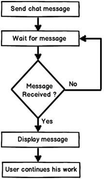
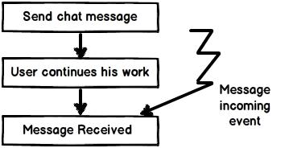
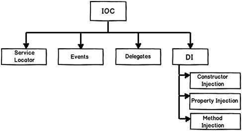

# Inversion of control (IoC)

**Inversion of control** (**IoC**) is a concept where the control flow of application is inverted.

If you go back to old computer programming days, program flow used to run in its own control. For instance let's consider a simple chat application flow:

1. End user sends chat message.
2. Application waits for the message from the other end.
3. If no message is found it goes to step 2 or else moves to step 4.
4. Displays the message.
5. User continues with his work ahead.

Now if you analyze the program's control flow closely, it's sequential. The program is in control of itself. Inversion of control means that the program delegates control to someone else who will drive the flow. For instance, if we make the chat application event based then the flow of the program will look like this:

Now the program's control flow is not sequential, it's event based. So, now the control is inverted. So rather than the internal program controlling the flow, events drive the program flow. Event flow approach is more flexible as there is no direct invocation which leads to more flexibility.

IoC can be implemented by events, callback delegates, observer pattern, dependency injection (DI) and other ways:

