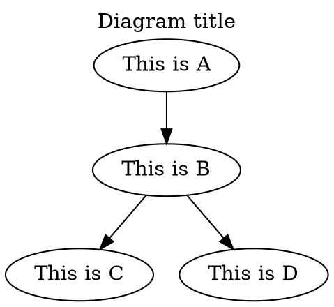

# UML diagrams

## Graphviz

- [↑ Graphviz](https://graphviz.org)

```dot
digraph DiagramName {

  labelloc="t";
  label="Diagram title";

  A [label="This is A"]
  B [label="This is B"]
  C [label="This is C"]
  D [label="This is D"]

  A -> B
  B -> { C, D }

}
```

## Other tools

- [↑ PlantUML](https://plantuml.com)
- [↑ Mermaid](https://mermaid-js.github.io/mermaid)