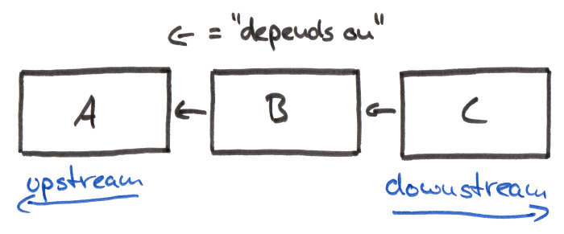
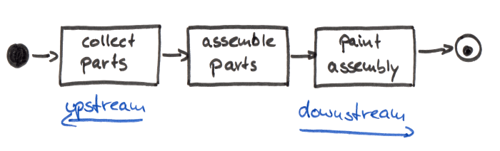

# Upstream and downstream

Dependency rule: in a chain of items each item depends on all the items upstream from its viewpoint.

Value rule: moving downstream, each step adds more value to the product.

## Examples

Component C depends on component B, and B depends on A:

The closer a service is to consumer, the farther downstream it is:

A production process:

Open source projects:

## Stack Overflow answer

> If someone destroyed the downstream part of the river, this would have no impact upstream. If someone destroyed the upstream part of the river, this would impact downstream, i.e. it wouldn't get any water.
>
> The downstream part of the river can't get any water unless it comes from upstream i.e. downstream is dependent on upstream for its water.

[↑ Which way are downstream and upstream services?](https://softwareengineering.stackexchange.com/a/395738/219147)

## Links

[↑ What is Upstream and Downstream in Software Development?](https://reflectoring.io/upstream-downstream)

[↑ Upstream (software development)](<https://en.wikipedia.org/wiki/Upstream_(software_development)>).
