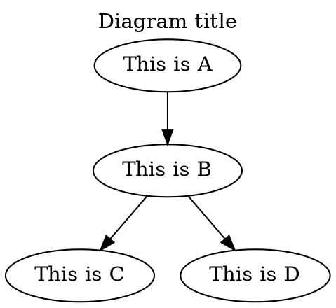
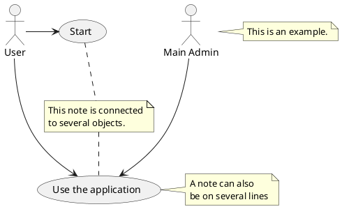

# Graphviz & PlantUML

## Graphviz

- [↑ Graphviz](https://graphviz.org)



## PlantUML

- [↑ PlantUML](https://plantuml.com)

- [↑ PlantUML Server](https://github.com/plantuml/plantuml-server)

```bash
docker run -d -p 8080:8080 plantuml/plantuml-server:jetty
```

Visual Studio code settings:

```json
"plantuml.server": "http://localhost:8080"
```

Example:


