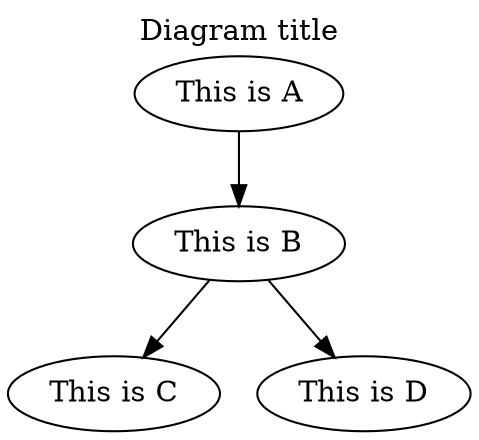
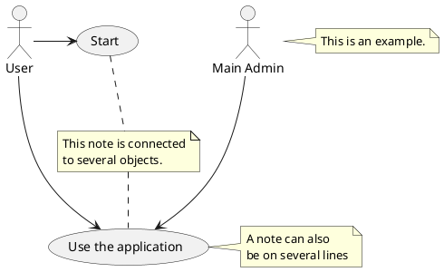
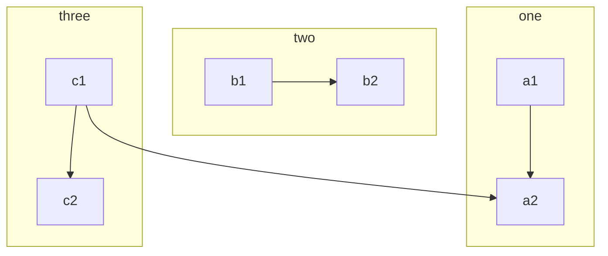

# Graphviz, PlantUML, Mermaid

## Graphviz

- [↑ Graphviz](https://graphviz.org).



## PlantUML

[↑ PlantUML](https://plantuml.com).

[↑ PlantUML Server](https://github.com/plantuml/plantuml-server).

```bash
docker run -d -p 7077:8080 plantuml/plantuml-server:jetty
```

Visual Studio code settings:

```json
"plantuml.server": "http://localhost:7077"
```

An `example.puml` file:



## Mermaid

[↑ Mermaid](https://mermaid.js.org) is a JavaScript based diagramming and charting tool that renders Markdown-inspired text definitions to create and modify diagrams dynamically.

GitHub now supports Mermaid syntax in Markdown:

```text
flowchart TB
    c1-->a2
    subgraph one
    a1-->a2
    end
    subgraph two
    b1-->b2
    end
    subgraph three
    c1-->c2
    end
```

which renders to:


