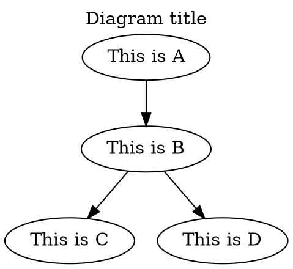

# Graphviz & PlantUML

## Graphviz

- [↑ Graphviz](https://graphviz.org)



## PlantUML

- [↑ PlantUML](https://plantuml.com)
- [↑PlantUML Server](https://github.com/plantuml/plantuml-server)

Visual Studio code settings:

```json
"plantuml.server": "http://localhost:8080"
```
