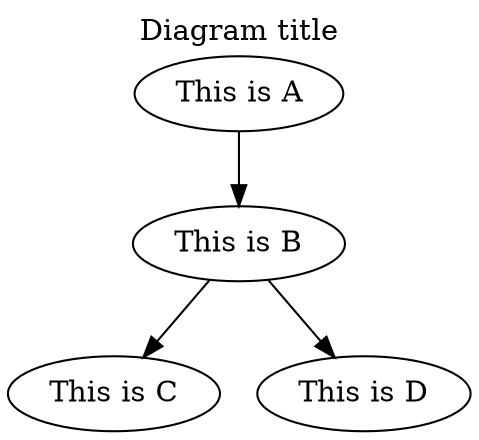
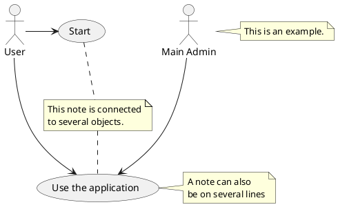
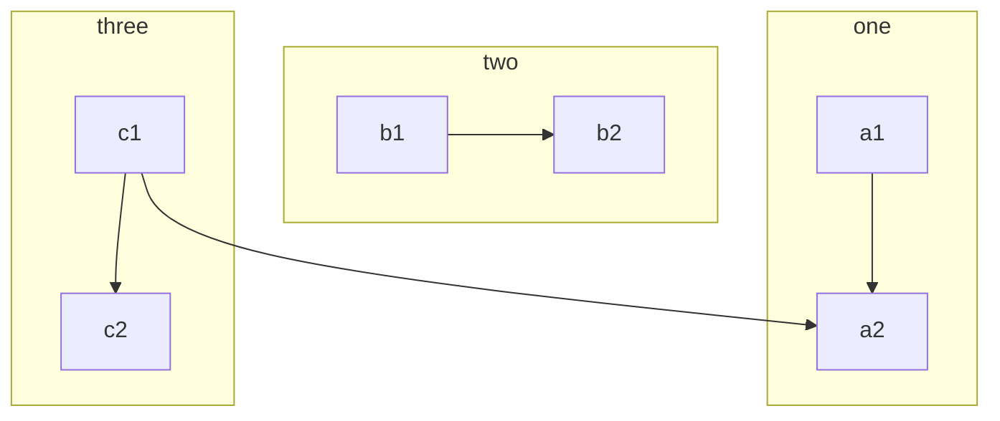

# C4, Graphviz, PlantUML, Mermaid

## Table of contents

- [C4, Graphviz, PlantUML, Mermaid](#c4-graphviz-plantuml-mermaid)
  - [Table of contents](#table-of-contents)
  - [C4](#c4)
  - [Graphviz](#graphviz)
  - [PlantUML](#plantuml)
  - [Mermaid](#mermaid)

## C4

The [↑ C4 model](https://c4model.com) is a graphical notation technique for modeling the architecture of software systems.

The C4 model was created by the software architect Simon Brown between 2006 and 2011.

- **Context diagrams**: show the system in scope and its relationship with users and other systems
- **Container diagrams**. A container represents an application or a data store
- **Component diagrams**
- **Code diagrams**: programming code

[↑ Денис Цветцих — C4 model на практике](https://www.youtube.com/watch?v=MBZLYQ84ieY).

## Graphviz

[↑ Graphviz](https://graphviz.org) is an open source graph visualization software.

Example of a diagram written in [↑ DOT](https://graphviz.org/doc/info/lang.html) language:



## PlantUML

[↑ PlantUML](https://plantuml.com) is a diagram creation tool.

[↑ PlantUML Server](https://github.com/plantuml/plantuml-server) is a web application that generates UML diagrams.

```bash
docker run --detach --publish 7077:8080 plantuml/plantuml-server:jetty
```

Visual Studio Code settings:

```json
"plantuml.server": "http://localhost:7077"
```

An `example.puml` file:



## Mermaid

[↑ Mermaid](https://mermaid.js.org) is a JavaScript based diagramming and charting tool that renders Markdown-inspired text definitions to create and modify diagrams dynamically.

GitHub now supports Mermaid syntax in Markdown:

```text
flowchart TB
    c1-->a2
    subgraph one
    a1-->a2
    end
    subgraph two
    b1-->b2
    end
    subgraph three
    c1-->c2
    end
```

which renders to:


