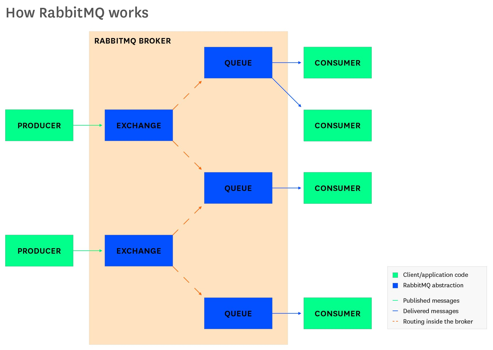

# RabbitMQ

- [RabbitMQ](#rabbitmq)
  - [Basics](#basics)
  - [Installation](#installation)
    - [Kubernetes](#kubernetes)
      - [Running](#running)
      - [Performance test](#performance-test)
      - [Commands](#commands)

## Basics

[Explaination of basics ↑](https://www.rabbitmq.com/tutorials/amqp-concepts.html)



## Installation

### Kubernetes

Install `rabbitmq` plugin using `krew` kubectl plugin manager:

```bash
kubectl krew install rabbitmq
kubectl rabbitmq version
kubectl rabbitmq help
```

Install [cluster operator ↑](https://www.rabbitmq.com/kubernetes/operator/operator-overview.html):

```bash
kubectl rabbitmq install-cluster-operator
```

#### Running

```bash
YOUR_NAMESPACE=mialkin
CLUSTER_NAME=mialkin-rabbitmq
kubectl rabbitmq -n $YOUR_NAMESPACE create $CLUSTER_NAME --replicas 1
# Above Requests 1 CPU and 2.15 GB of RAM:
kubectl rabbitmq -n $YOUR_NAMESPACE secrets $CLUSTER_NAME
kubectl rabbitmq -n $YOUR_NAMESPACE manage $CLUSTER_NAME
```

#### Performance test

```bash
username="$(kubectl get secret hello-world-default-user -o jsonpath='{.data.username}' | base64 --decode)"
password="$(kubectl get secret hello-world-default-user -o jsonpath='{.data.password}' | base64 --decode)"
service="$(kubectl get service hello-world -o jsonpath='{.spec.clusterIP}')"

kubectl run perf-test --image=pivotalrabbitmq/perf-test -- --uri amqp://$username:$password@$service
kubectl rabbitmq -n YOUR_NAMESPACE perf-test CLUSTER_NAME

kubectl delete pod perf-test -n YOUR_NAMESPACE
kubectl delete service perf-test -n YOUR_NAMESPACE
```

#### Commands

| Command                                                             | Description                                   |
| ------------------------------------------------------------------- | --------------------------------------------- |
| kubectl rabbitmq delete CLUSTER_NAME                                | Delete cluster                                |
| kubectl rabbitmq get CLUSTER_NAME                                   | Display all resources associated with cluster |
| kubectl rabbitmq list                                               | List all clusters                             |
| kubectl rabbitmq secrets CLUSTER_NAME                               | Display default user secrets                  |
