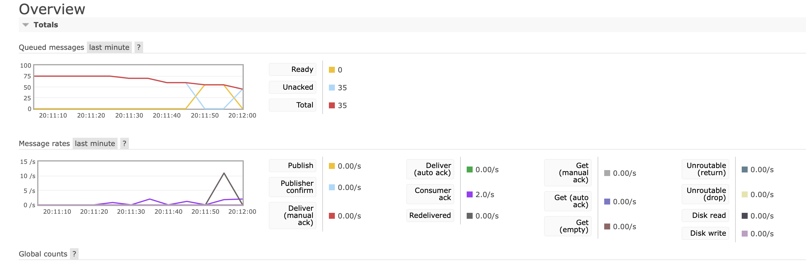

# RabbitMQ

- [RabbitMQ](#rabbitmq)
  - [Basics](#basics)
  - [Exchanges](#exchanges)
  - [Exchange types](#exchange-types)
    - [Direct exchange](#direct-exchange)
    - [Fanout exchange](#fanout-exchange)
    - [Topic exchange](#topic-exchange)
    - [Headers exchange](#headers-exchange)
  - [Virtual hosts](#virtual-hosts)
  - [Statuses](#statuses)
  - [Channels](#channels)
  - [Connections](#connections)
  - [AMQP 0-9-1 methods](#amqp-0-9-1-methods)
  - [Rejecting Messages](#rejecting-messages)
  - [Installation](#installation)
    - [Kubernetes](#kubernetes)
      - [Running](#running)
      - [Performance test](#performance-test)
      - [Commands](#commands)

## Basics

- [↑ AMQP 0-9-1 Model Explained](https://www.rabbitmq.com/tutorials/amqp-concepts.html)
- [↑ AMQP 0-9-1 Complete Reference Guide](https://www.rabbitmq.com/amqp-0-9-1-reference.html)
- [↑ .NET/C# Client API Guide](https://www.rabbitmq.com/dotnet-api-guide.html)
- [↑ EasyNetQ](https://github.com/EasyNetQ/EasyNetQ/wiki/Introduction)
- [↑ Consumer Acknowledgements and Publisher Confirms](https://www.rabbitmq.com/confirms.html)

## Exchanges

**Exchanges** are AMQP 0-9-1 entities where messages are sent. Exchanges take a message and route it into zero or more queues. The routing algorithm used depends on the **exchange type** and rules called **bindings**.


## Exchange types

AMQP 0-9-1 brokers provide four exchange types: direct, fanout, topic, headers.

### Direct exchange

A direct exchange delivers messages to queues based on the message routing key. Here is how it works:

- A queue binds to the exchange with a routing key `K`
- When a new message with routing key R arrives at the direct exchange, the exchange routes it to the queue if `K` = `R`

### Fanout exchange

A fanout exchange routes messages to all of the queues that are bound to it and the routing key is ignored. If `N` queues are bound to a fanout exchange, when a new message is published to that exchange a copy of the message is delivered to all `N` queues.

### Topic exchange

Topic exchanges route messages to one or many queues based on matching between a message routing key and the pattern that was used to bind a queue to an exchange. The topic exchange type is often used to implement various publish/subscribe pattern variations. Topic exchanges are commonly used for the multicast routing of messages.

Topic exchanges have a very broad set of use cases. Whenever a problem involves multiple consumers/applications that selectively choose which type of messages they want to receive, the use of topic exchanges should be considered.

### Headers exchange

A headers exchange is designed for routing on multiple attributes that are more easily expressed as message headers than a routing key. Headers exchanges ignore the routing key attribute. Instead, the attributes used for routing are taken from the headers attribute. A message is considered matching if the value of the header equals the value specified upon binding.

It is possible to bind a queue to a headers exchange using more than one header for matching. In this case, the broker needs one more piece of information from the application developer, namely, should it consider messages with any of the headers matching, or all of them? This is what the `x-match` binding argument is for. When the `x-match` argument is set to "any", just one matching header value is sufficient. Alternatively, setting `x-match` to "all" mandates that all the values must match.

Headers exchanges can be looked upon as "direct exchanges on steroids". Because they route based on header values, they can be used as direct exchanges where the routing key does not have to be a string; it could be an integer or a hash (dictionary) for example.

Note that headers beginning with the string `x-` will not be used to evaluate matches.

## Virtual hosts

To make it possible for a single broker to host multiple isolated "environments" (groups of users, exchanges, queues and so on), AMQP 0-9-1 includes the concept of **virtual hosts** (**vhosts**). They provide completely isolated environments in which AMQP entities live. Protocol clients specify what vhosts they want to use during connection negotiation.

## Statuses



| Status              | Meaning                                                                                                                                                                                            |
| ------------------- | -------------------------------------------------------------------------------------------------------------------------------------------------------------------------------------------------- |
| Ready               | Messages that were never delivered to consumer                                                                                                                                                     |
| Unacked             | Messages that were delivered but were not acked                                                                                                                                                    |
| Total               | Ready + Unacked                                                                                                                                                                                    |
| Delivery (auto ack) | Number of messages prefeteched by consumer with `autoack` set to `true` they are acked automatically, even if they were not proccessed yet: `channel.BasicConsume(queue, autoAck: true, consumer)` |
| Consumer ack        | Number of messages acked by consumer when `autoack` is set to `false`                                                                                                                              |
| Redelivered         | Number of unacked messages that were resend to consumers                                                                                                                                           |

Imagine Consumer 1 prefteched 9 messages from a queue and haven't acknowledged them. No new messages arrive to the queue, so Consumer 1 stays still. Now Consumer 2 starts consuming from the queue and stays still, because no new messages arrive to the queue. If we kill Consumer 1, then Consumer 2 will start receiving (redelivery) those 9 messages from Rabbit, that were not acked by Consumer 1.

## Channels

Some applications need multiple connections to the broker. However, it is undesirable to keep many TCP connections open at the same time because doing so consumes system resources and makes it more difficult to configure firewalls. AMQP 0-9-1 connections are multiplexed with **channels** that can be thought of as "lightweight connections that share a single TCP connection".>

Every protocol operation performed by a client happens on a channel. Communication on a particular channel is completely separate from communication on another channel, therefore every protocol method also carries a channel ID (a.k.a. channel number), an integer that both the broker and clients use to figure out which channel the method is for.

A channel only exists in the context of a connection and never on its own. When a connection is closed, so are all channels on it.

For applications that use multiple threads/processes for processing, it is very common to open a new channel per thread/process and not share channels between them.

## Connections

AMQP 0-9-1 connections are typically long-lived. AMQP 0-9-1 is an application level protocol that uses TCP for reliable delivery. Connections use authentication and can be protected using TLS. When an application no longer needs to be connected to the server, it should gracefully close its AMQP 0-9-1 connection instead of abruptly closing the underlying TCP connection.

## AMQP 0-9-1 methods

AMQP 0-9-1 is structured as a number of **methods**. Methods are operations (like HTTP methods) and have nothing in common with methods in object-oriented programming languages. Protocol methods in AMQP 0-9-1 are grouped into *classes*. Classes are just logical groupings of AMQP methods.

Let us take a look at the `exchange` class, a group of methods related to operations on exchanges. It includes the following operations: `exchange.declare`, `exchange.declare-ok`,
`exchange.delete`, `exchange.delete-ok`.

Not all AMQP 0-9-1 methods have counterparts. Some (`basic.publish` being the most widely used one) do not have corresponding "response" methods and some others (`basic.get`, for example) have more than one possible "response".

## Rejecting Messages

When a consumer application receives a message, processing of that message may or may not succeed. An application can indicate to the broker that message processing has failed (or cannot be accomplished at the time) by rejecting a message. When rejecting a message, an application can ask the broker to discard or requeue it. When there is only one consumer on a queue, make sure you do not create infinite message delivery loops by rejecting and requeueing a message from the same consumer over and over again.

## Installation

### Kubernetes

Install `rabbitmq` plugin using `krew` kubectl plugin manager:

```bash
kubectl krew install rabbitmq
kubectl rabbitmq version
kubectl rabbitmq help
```

Install [cluster operator ↑](https://www.rabbitmq.com/kubernetes/operator/operator-overview.html):

```bash
kubectl rabbitmq install-cluster-operator
```

#### Running

```bash
YOUR_NAMESPACE=mialkin
CLUSTER_NAME=mialkin-rabbitmq
kubectl rabbitmq -n $YOUR_NAMESPACE create $CLUSTER_NAME --replicas 1
# Above Requests 1 CPU and 2.15 GB of RAM:
kubectl rabbitmq -n $YOUR_NAMESPACE secrets $CLUSTER_NAME
kubectl rabbitmq -n $YOUR_NAMESPACE manage $CLUSTER_NAME
```

#### Performance test

```bash
username="$(kubectl get secret hello-world-default-user -o jsonpath='{.data.username}' | base64 --decode)"
password="$(kubectl get secret hello-world-default-user -o jsonpath='{.data.password}' | base64 --decode)"
service="$(kubectl get service hello-world -o jsonpath='{.spec.clusterIP}')"

kubectl run perf-test --image=pivotalrabbitmq/perf-test -- --uri amqp://$username:$password@$service
kubectl rabbitmq -n YOUR_NAMESPACE perf-test CLUSTER_NAME

kubectl delete pod perf-test -n YOUR_NAMESPACE
kubectl delete service perf-test -n YOUR_NAMESPACE
```

#### Commands

| Command                               | Description                                   |
| ------------------------------------- | --------------------------------------------- |
| kubectl rabbitmq delete CLUSTER_NAME  | Delete cluster                                |
| kubectl rabbitmq get CLUSTER_NAME     | Display all resources associated with cluster |
| kubectl rabbitmq list                 | List all clusters                             |
| kubectl rabbitmq secrets CLUSTER_NAME | Display default user secrets                  |
