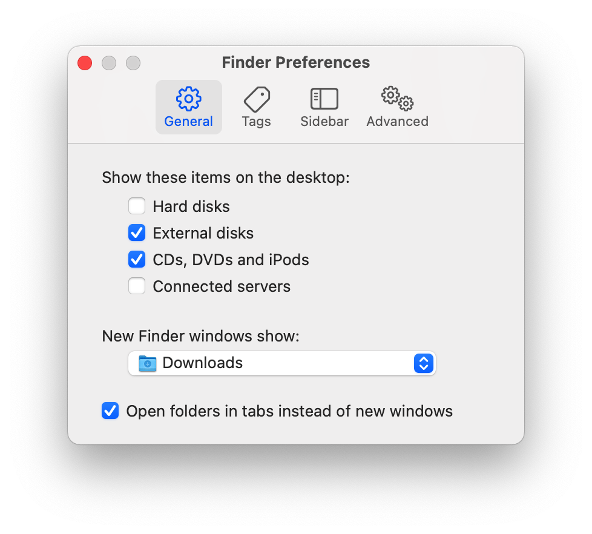

# macOS

- [macOS](#macos)
  - [Settings](#settings)
    - [Aliases](#aliases)
    - [Finder](#finder)
    - [Terminal](#terminal)
      - [Change computer name](#change-computer-name)
      - [Turn off Message of the Day" (motd)](#turn-off-message-of-the-day-motd)
      - [Use Touch ID](#use-touch-id)
    - [System Settings](#system-settings)
      - [Accessibility](#accessibility)
      - [Desktop \& Dock](#desktop--dock)
      - [Keyboard](#keyboard)
      - [Lock Screen](#lock-screen)
      - [Menu Bar](#menu-bar)
      - [Trackpad](#trackpad)
  - [Applications](#applications)
    - [Brew](#brew)
    - [Buzz](#buzz)
    - [DBeaver Community](#dbeaver-community)
    - [Etcher](#etcher)
    - [ExifTool](#exiftool)
    - [FFmpeg](#ffmpeg)
      - [Convert](#convert)
      - [Cut](#cut)
      - [Change bitrate](#change-bitrate)
      - [Concatenate](#concatenate)
    - [Fluor](#fluor)
    - [Gifox](#gifox)
    - [HandBrake](#handbrake)
    - [INNA](#inna)
    - [Keka](#keka)
    - [Lens](#lens)
    - [LM Studio](#lm-studio)
    - [Logi Tune](#logi-tune)
    - [LosslessCut](#losslesscut)
    - [MonitorControl](#monitorcontrol)
    - [Mos](#mos)
    - [OBS](#obs)
    - [Preview](#preview)
    - [`ripgrep`](#ripgrep)
    - [SensibleSideButtons](#sensiblesidebuttons)
    - [Sublime Text](#sublime-text)
      - [`subl` command](#subl-command)
      - [Configuration](#configuration)
      - [Split selection into lines](#split-selection-into-lines)
    - [Visual Studio Code](#visual-studio-code)
    - [yt-dlp](#yt-dlp)
  - [Miscellaneous](#miscellaneous)
    - [TTL](#ttl)
    - [Flush DNS cache](#flush-dns-cache)
    - [Install developers' applications](#install-developers-applications)
    - [IP address](#ip-address)
    - [Key repeating](#key-repeating)
    - [Run application](#run-application)
    - [Copy text to clipboard](#copy-text-to-clipboard)
    - [User scripts folder](#user-scripts-folder)

## Settings

### Aliases

```bash
cd ~/Downloads

echo "alias ll='ls -la'" >> ~/.zshrc && \
echo "alias cls='clear'" >> ~/.zshrc && \
echo "alias python='python3'" >> ~/.zshrc && \
echo "alias dotwatch='dotnet watch --no-hot-reload'" >> ~/.zshrc
```

### Finder

Always show hidden files in Finder:

```bash
defaults write com.apple.Finder AppleShowAllFiles true && \
killall Finder
```

Set `Downloads` as default folder:



Show path bar: View -> Show Path Bar.

### Terminal

#### Change computer name

Settings -> General -> About -> Name.

To verify the change:

```go
scutil --get ComputerName
```

#### Turn off Message of the Day" (motd)

```bash
touch ~/.hushlogin
```

If you ever want it back:

```go
rm ~/.hushlogin
```

#### Use Touch ID

To use Touch ID for sudo commands in the Terminal run:

```bash
sudo vim /etc/pam.d/sudo
```

Add the following line **immediately below** the first line:

```text
auth       sufficient     pam_tid.so
```

Save with `wq!` and exit.

### System Settings

#### Accessibility

Pointer Control -> Trackpad Options... -> Dragging style -> Three Finger Drag.

#### Desktop & Dock

Hot Corners...

|                 |                 |
| --------------- | --------------- |
| Mission Control | Mission Control |
| Apps            | Desktop         |

#### Keyboard

Input Sources -> Add Russian — PC.

#### Lock Screen

- Turn display off on battery when inactive -> For 30 minutes
- Turn display off on power adapter when inactive -> For 1 hour
- Require password after screen saver begins or display is turned off -> Immediately
- Show user name and photo -> Off

#### Menu Bar

Uncheck what's not needed under **Menu Bar Controls** and **Allow in the Menu Bar** sections.

#### Trackpad

- More gestures -> Swipe between pages -> Off

## Applications

### Brew

[↑ Brew](https://brew.sh/) is the package manager for macOS and Linux.

### Buzz

[↑ Buzz](https://github.com/chidiwilliams/buzz) is a tool that transcribes and translates audio offline. Powered by OpenAI's [↑ Whisper](https://openai.com/index/whisper/).

### DBeaver Community

[↑ DBeaver Community](https://dbeaver.io/download) is a free cross-platform database tool.

### Etcher

[↑ Etcher](https://etcher.balena.io) is a cross-platform tool to flash OS images onto SD cards and USB drives safely and easily.

### ExifTool

[↑ ExifTool](https://exiftool.org) is a command-line application for reading, writing and editing meta information in a wide variety of files.

```bash
brew install exiftool
```

Output image info:

```bash
exiftool image.jpg
```

Update image tags:

```bash
export THE_DATE="2016:08:01 00:00:03";
exiftool -DateTimeDigitized=$THE_DATE -DateTimeOriginal=$THE_DATE image.jpg
```

Compare two images:

```bash
exiftool image1.jpg -diff image2.jpg --system:all -e
```

Only show files that do not have `DateTimeDigitized` set:

```bash
exiftool -filename -if 'not ($datetimeoriginal)' .
```

Only show files that do not have `DateTimeDigitized` set:

```bash
exiftool -filename -if 'not ($datetimedigitized)' .
```

Get all time information about the image:

```bash
exiftool -time:all image.jpg
```

Move all files that don't have `DateTimeOriginal` tag set on them from current folder to a subfolder:

```bash
exiftool -if 'not $datetimeoriginal' -Directory=mysubfolder .
```

### FFmpeg

[↑ FFmpeg](https://www.ffmpeg.org/) is the leading multimedia framework, able to decode, encode, transcode, mux, demux, stream, filter and play pretty much anything that humans and machines have created.

It supports the most obscure ancient formats up to the cutting edge.

[↑ macOS installation](https://trac.ffmpeg.org/wiki/CompilationGuide/macOS):

```bash
brew install ffmpeg
```

#### Convert

MP4 to MOV:

```bash
ffmpeg -i input.mp4 -f mov output.mov
```

MOV to MP4:

```bash
ffmpeg -i input.mov -crf 18 output.mp4
```

`-crf` sets the quality: a value of `0` is lossless, and `18` looks lossless but really isn't.

#### Cut

```bash
ffmpeg -ss 00:02:35 -to 00:03:51 -i input.mp4 -c copy output.mp4
```

#### Change bitrate

```bash
ffmpeg -y -i input.mp4 -c:v libx264 -b:v 2600k -pass 1 -an -f null /dev/null && \
ffmpeg -i input.mp4 -c:v libx264 -b:v 2600k -pass 2 -c:a aac -b:a 128k output.mp4
```

[↑ Two-Pass](https://trac.ffmpeg.org/wiki/Encode/H.264#twopass).

#### Concatenate

[↑ Concatenating](https://trac.ffmpeg.org/wiki/Concatenate) multiple files into one:

```bash
ffmpeg -f concat -i mylist.txt -c copy output.mp4
```

`mylist.txt`:

```text
file 'movie_1.mp4'
file 'movie_2.mp4'
file 'movie_3.mp4'
```

### Fluor

[↑ Fluor](https://github.com/Pyroh/Fluor) is a macOS application for switching Fn keys' mode based on active application.

```bash
brew install --cask fluor
```

### Gifox

[↑ Gifox](https://gifox.app) is a macOS status bar application for recording, converting, editing and sharing GIFs.

### HandBrake

[↑ HandBrake](https://handbrake.fr) is an application for converting video from nearly any format to a selection of modern, widely supported codecs.

### INNA

[↑ IINA](https://iina.io/) `/ˈiːnə/` is the the modern media player for macOS.

### Keka

[↑ Keka](https://www.keka.io) is a macOS file archiver.

### Lens

[↑ Lens](https://k8slens.dev/) is a Kubernetes IDE.

### LM Studio

[↑ LM Studio](https://lmstudio.ai/) is a desktop application that allows you to discover, download, and run LLMs locally on your own computer

### Logi Tune

[↑ Logi Tune](https://www.logitech.com/en-eu/video-collaboration/software/logi-tune-software.html) is a software for Logitech web cameras.

### LosslessCut

[↑ LosslessCut](https://github.com/mifi/lossless-cut) is an application that cuts the data stream and directly copies it over.

### MonitorControl

[↑ MonitorControl](https://monitorcontrol.app) is an app that controls external display brightness and volume.

### Mos

[↑ Mos](https://mos.caldis.me) is a lightweight tool used to smooth scrolling and set scroll direction independently for your mouse on macOS.

### OBS

[↑ OBS Studio](https://obsproject.com/) is free and open source software for video recording and live streaming.

### Preview

Drag/scroll with mouse: <kbd>Option</kbd> + <kbd>Spacebar</kbd>.

### `ripgrep`

```bash
brew install ripgrep
```

```bash
rg "dotnet run"
```

### SensibleSideButtons

[↑ SensibleSideButtons](https://sensible-side-buttons.archagon.net) is an application that enables side navigation buttons on your third-party mice

May need to add this application to [↑Open at login](https://support.apple.com/en-is/guide/mac-help/mh15189/mac) after installation.

### Sublime Text

[↑ Sublime Text](https://www.sublimetext.com/) is a shareware text and source code editor available for Windows, macOS, and Linux.

#### `subl` command

```bash
echo 'export PATH="/Applications/Sublime Text.app/Contents/SharedSupport/bin:$PATH"' >> ~/.zprofile
```

#### Configuration

```json
{
  "font_size": 13,
  "open_files_in_new_window": false
}
```

#### Split selection into lines

| Shortcut         | Description                   |
| ---------------- | ----------------------------- |
| <kbd>⌘ ⇧ L</kbd> | Selection -> Split into Lines |

### Visual Studio Code

[↑ Visual Studio Code](https://code.visualstudio.com)

[↑ Install `code` command in PATH](https://stackoverflow.com/a/68273710/1833895).

Custom snippets:

<kbd>Cmd</kbd> + <kbd>Shift</kbd> + <kbd>P</kbd> Type **Snippets**.

````json
{
  "InsertPythonCode": {
    "scope": "md,markdown",
    "prefix": ["py"],
    "body": ["```py", "$0", "```", ""],
    "description": "Insert Python code"
  }
}
````

### yt-dlp

[↑ yt-dlp](https://github.com/yt-dlp/yt-dlp) is is a feature-rich command-line audio/video downloader with support for thousands of sites.

```bash
brew update
brew install yt-dlp
```

```bash
yt-dlp VIDEO_URL
```

To keep the tool working (especially when sites change their video delivery methods), run:

```bash
brew upgrade yt-dlp
```

## Miscellaneous

### TTL

```bash
sysctl -w net.inet.ip.ttl           # Get current value
sudo sysctl -w net.inet.ip.ttl=65   # Set value to 65
```

### Flush DNS cache

```bash
sudo killall -HUP mDNSResponder
```

```bash
echo "alias flush-dns='sudo killall -HUP mDNSResponder'" >> ~/.zshrc
```

### Install developers' applications

1. Just move application into `/Applications` folder and open it
2. If you see `"YOUR_APPLICATION" cannot be opened because the developer cannot be verified`, please open up **System Preferences** → **Security & Privacy** → **General** → **Open Anyway**.
3. If you see the error `The application YOUR_APPLICATION can't be opened` error on launch, you could `chmod +x "/Applications/YOUR_APPLICATION.app/Contents/MacOS/YOUR_APPLICATION`"

### IP address

```bash
curl ifconfig.me
```

### Key repeating

Enable key repeating:

```bash
defaults write -g ApplePressAndHoldEnabled -bool false
```

Next, restart your computer and you should now be able to repeat all characters.

Replace `true` with `false` to revert changes back.

### Run application

```sh
open -a calculator                  # -a is for "application"
ll /Applications                    # List installed apps
open -a "Microsoft Remote Desktop"
```

### Copy text to clipboard

```sh
cat example.txt \| pbcopy
```

### User scripts folder

```bash
ll /usr/local/bin
```

Check if folder is in `PATH` environment variable:

```bash
echo "$PATH" | tr ':' '\n'
```

Add path if it's not there:

```bash
echo 'export PATH="/usr/local/bin:$PATH"' >> ~/.zshrc
```
